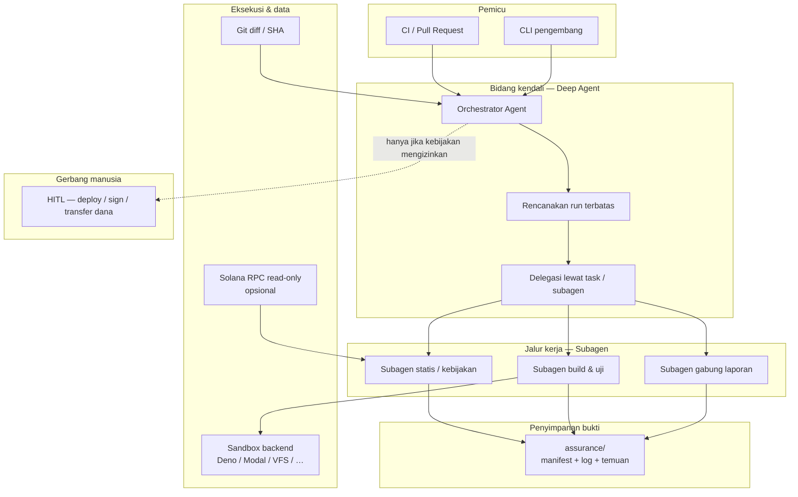
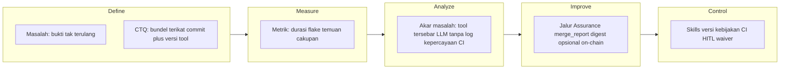

# Assurance Run — Arsitektur

**Versi 0.2** — Isi teknis lengkap bahasa Indonesia ada di dokumen ini (**§1–§5**). Ringkasan eksekutif produk: [WHITEPAPER.id.md](./WHITEPAPER.id.md).

**Rujukan bahasa Inggris (kanonik, terpadu di whitepaper):** [WHITEPAPER.en.md — § 9. Architecture](./WHITEPAPER.en.md#9-architecture).

| | |
|--|--|
| **Hub bahasa** | [← ARCHITECTURE.md](./ARCHITECTURE.md) |
| **English (stub)** | [ARCHITECTURE.en.md](./ARCHITECTURE.en.md) |
| **Alat** | [TOOLS.md](./TOOLS.md) · [TOOLS.id.md](./TOOLS.id.md) · [WHITEPAPER.en.md § 10](./WHITEPAPER.en.md#10-integration-tools-and-execution-surface) |
| **Referensi** | [REFERENCES.md](./REFERENCES.md) · [REFERENCES.id.md](./REFERENCES.id.md) · [WHITEPAPER.en.md § 11](./WHITEPAPER.en.md#11-official-references-standards-and-methodology) |
| **Whitepaper** | [WHITEPAPER.id.md](./WHITEPAPER.id.md) · [WHITEPAPER.en.md](./WHITEPAPER.en.md) |

**SDLC / DMAIC:** [§ 3 di bawah](#3-penjajaran-sdlc-dan-lean-six-sigma) · [WHITEPAPER.en.md § 9.3](./WHITEPAPER.en.md#93-sdlc-and-lean-six-sigma-alignment) · **Dasbor UX:** [docs/DASHBOARD-UX.id.md](./docs/DASHBOARD-UX.id.md) · [docs/DASHBOARD-UX.en.md](./docs/DASHBOARD-UX.en.md)

---

## 1. Arsitektur tingkat tinggi

Pada layer ini, **Assurance Run** adalah **bidang kendali** yang mengorkestrasi **pemeriksaan berbasis bukti** pada **perubahan kode terbatas**, lalu menulis **satu bundel laporan** yang terikat pada **commit git**. Eksekusi perintah berisiko diisolasi; **penandatanganan** dan **deployment** berada di luar jalur default.



**Alur (konseptual):**

1. **Pemicu** memberi **rentang commit** atau **ref PR**.
2. **Orkestrator** memuat **skills** (kebijakan Anchor/keamanan) dan menyusun **rencana** (apa dijalankan, urutan, tingkat risiko).
3. **Subagen** menjalankan tugas **sempit**: sinyal kebijakan/statik, **ter-sandbox** compile/uji, dedupe/gabung.
4. **Artefak** ditulis di prefiks stabil (mis. `assurance/`) dengan **hash** dan **versi alat**.
5. **HITL** hanya untuk tindakan **tak terbalikkan** atau **privileg** (bukan loop default).

**Tampilan layer tool:** tool callable mana ke jalur dan backend mana — **[TOOLS.id.md — Arsitektur tingkat tinggi (tools)](./TOOLS.id.md#high-level-architecture-tools)**.

---

## 2. Arsitektur tingkat rendah

Ini memetakan produk ke **`deepagentsjs`** (`ASST/deepagentsjs`): `createDeepAgent`, middleware, backend, dan **tool kustom** opsional untuk Solana.

### 2.1 Runtime inti

| Konsep | Peran dalam Assurance Run | Sentuhan deepagentsjs |
|--------|---------------------------|------------------------|
| **Orkestrator** | Satu entri graf; memiliki rencana + gabungan akhir | `createDeepAgent({ ... })` |
| **Subagen** | Prompt + tool terisolasi per jalur | `subagents: [...]` → `createSubAgentMiddleware` |
| **Kebijakan / skills** | Checklist versi (jebakan Anchor, aturan org) | `createSkillsMiddleware({ backend, sources })` |
| **Filesystem** | Menulis `findings.md`, log, manifest | `createFilesystemMiddleware({ backend })` |
| **Percakapan panjang** | Log CI panjang diringkas | `createSummarizationMiddleware` |
| **Keanehan penyedia** | Pasangan tool_call / ToolMessage valid | `createPatchToolCallsMiddleware` |
| **Pelacakan tugas** | Langkah terlihat di UI/log | `todoListMiddleware()` |
| **Eksekusi sandbox** | `cargo`, `anchor`, skrip tidak di host | Backend yang mengimplementasikan **SandboxBackendProtocol** (lihat `libs/providers/*`, `examples/sandbox/`) |
| **Interrupt (HITL)** | Jeda sebelum tool sensitif (deploy, sign, hapus, …) | `interruptOn` + **checkpointer** — lihat §2.5 |

**Peta implementasi (TOOLS ↔ kode, subagen preset):** [deepagentsjs/docs/TOOLS-MAP.md](deepagentsjs/docs/TOOLS-MAP.md).

Tool bawaan meliputi **task** (delegasi), **write_todos**, tool filesystem, dan opsional **execute** bila backend mendukung sandbox.

### 2.2 Topologi backend

- **Jalur pengembangan default:** `StateBackend` atau persistensi ber-store untuk state **percakapan + berkas**.
- **Jalur verifikasi berat:** **factory** menyelesaikan backend **sandbox** (Deno / Modal / Daytona / …) untuk **execute** dan FS terisolasi bila dikonfigurasi.
- **Jalur baca Solana:** **tool kustom** (RPC `getAccount`, simulasi, dll.) dengan endpoint **read-only**; **tanpa** kunci privat di state agen secara default.

### 2.3 Tata letak artefak (ilustratif)

```
assurance/
  run-{sha-short}.json     # manifest: sha, versi alat, exit code, hash berkas
  findings.md              # ringkasan untuk manusia
  logs/                    # fragmen stdout/stderr yang disaring
```

### 2.4 Batas kepercayaan

| Zona | Asumsi kepercayaan |
|------|---------------------|
| **Orkestrator + LLM** | Tidak dipercaya untuk **fakta**; keluaran harus mengutip **tool** atau **log** |
| **Sandbox** | Eksekusi kode tidak dipercaya **terkandung**; batas sumber daya ditegakkan |
| **RPC read-only** | Integritas bergantung pada **penyedia RPC**; dokumentasikan endpoint |
| **Rahasia** | **Di luar pita**; tidak ditulis ke `findings.md` atau prompt secara default |

### 2.5 Human-in-the-loop (LangGraph)

Deep Agents mengimplementasikan HITL lewat **interrupt** LangGraph. Dokumentasi resmi: [LangChain — Human-in-the-loop (Deep Agents, JS)](https://docs.langchain.com/oss/javascript/deepagents/human-in-the-loop.md); indeks penuh: [docs.langchain.com/llms.txt](https://docs.langchain.com/llms.txt).

| Konsep | Perilaku |
|--------|----------|
| **`interruptOn`** | Peta nama tool → `true` (default: approve / edit / reject), `false` (tanpa interrupt), atau `{ allowedDecisions: ["approve" \| "edit" \| "reject"] }`. |
| **Checkpointer** | **Wajib** (mis. `MemorySaver`) agar state bertahan antara jeda dan **resume**. |
| **Hasil `invoke`** | Jika ada interrupt, periksa `result.__interrupt__` — antrian aksi yang menunggu keputusan. |
| **Resume** | `agent.invoke(new Command({ resume: { decisions } }), config)` dengan **`config.configurable.thread_id` yang sama** dengan invoke pertama. |
| **Beberapa tool** | Semua aksi yang perlu persetujuan digabung dalam **satu** interrupt; `decisions` harus **berurutan** sama seperti `actionRequests`. |
| **`edit`** | Mengizinkan mengubah argumen tool sebelum eksekusi (jika `allowedDecisions` memuat `"edit"`). |
| **Subagen** | Tiap subagen dapat **override** `interruptOn` (mis. `read_file` perlu approval hanya di subagen tertentu). |

Untuk Assurance Run, petakan tool berisiko (deploy, sign, broadcast RPC, hapus artefak produksi) ke **`interruptOn: true`** atau `{ allowedDecisions: ["approve", "reject"] }`; biarkan pemindaian read-only dan eksekusi ter-sandbox tanpa interrupt jika kebijakan mengizinkan.

### 2.6 Metodologi audit (skills) ↔ subagen

Alur kerja dari **skills** audit (recon, konteks, prep, **model ancaman berbasis repo**, pola Solana, augmentasi SARIF, *zeroize*, diagram, maturitas, kepatuhan spec, varian Semgrep, **keselamatan operator**, **pola API aman**) dapat dibagi ke **prompt + skills middleware** pada subagen yang ada — tanpa mengubah kontrak runtime:

| Fase | Subagen utama | Isi skill tipikal |
|------|----------------|-------------------|
| Cakupan & struktur | *static-policy* (awal) | CodeRecon, konteks mendalam |
| Sinyal & kebijakan | *static-policy* | Pemindai 6 pola Solana, VulnHunter, Semgrep; pengembangan aturan (*semgrep-rule-variant-creator*) |
| Bukti terstruktur | *merge-report* | Impor SARIF/weAudit ke graf (augmentation), ringkasan severity |
| Dokumen ↔ kode | *merge-report* atau jalur khusus | *spec-to-code-compliance* (whitepaper / desain vs `programs/`) |
| Maturitas / gate pra-rilis | *merge-report* atau manusia | *code-maturity-assessor* (scorecard 9 kategori) |
| Dependensi upstream | *static-policy* | *supply-chain-risk-auditor* (melengkapi `cargo audit` / lockfile) |
| Infrastruktur CI | Di luar graf agen | *devops* (pipeline, rahasia, K8s) |
| API monorepo | *static-policy* / layanan terpisah | *api-development* (Go/NestJS) bila relevan |
| Artefak berbahaya (niche) | Forensik / ops | *yara-rule-authoring* (YARA-X) — bukan audit sumber `programs/` |
| Model ancaman AppSec | *merge-report* atau jalur khusus | *security-threat-model* (berbasis bukti; opsional `*-threat-model.md`) |
| Keselamatan agen / operator | Kebijakan + HITL + prompt | *security-awareness* (URL, kredensial, social engineering) — bukan SAST |
| Desain layanan aman | *static-policy* / jalur off-chain | *security-best-practices* bersama *api-development* |
| Visual / laporan | *merge-report* atau manusia | Diagram dari Trailmark |

Orkestrasi **task** / **write_todos** / **HITL** mengikuti pola **deep agents** (delegasi, rencana, persetujuan). Indeks: **[REFERENCES.id.md — Metodologi audit](./REFERENCES.id.md)** dan **[TOOLS.id.md § I](./TOOLS.id.md)**. Pemetaan skill pada tabel di bawah mendukung fase **Analyze** dan **Improve** pada §3.

---

## 3. Penjajaran SDLC dan Lean Six Sigma

**SDLC** (Software Development Life Cycle) menamai fase dari kebutuhan hingga operasi. **Lean Six Sigma** di sini memakai **DMAIC** (Define, Measure, Analyze, Improve, Control) untuk memperbaiki *pipeline bukti keamanan*—melengkapi DMADV/DFSS saat merancang kemampuan baru (mis. keluaran JSON tergabung atau MVP digest on-chain). Bagian ini mengikat model tersebut ke Assurance Run tanpa menggantikan desain §2 atau pseudo-kode §4.

### 3.1 DMAIC di atas Assurance Run



| Fase | Interpretasi Assurance Run |
|------|------------------------------|
| **Define** | Masalah dan CTQ di [WHITEPAPER.id.md](./WHITEPAPER.id.md) §1: manifest terulang, SHA git, log tersaring, temuan tergabung. |
| **Measure** | Exit code, jumlah SARIF, severity `cargo audit`, lulus/gagal uji, durasi—dicatat di `assurance/run-*.json` ([TOOLS.id.md](./TOOLS.id.md)). |
| **Analyze** | Petakan ke jalur (*static-policy* vs *build-verify* vs *merge-report*); gunakan skills di §2.6. |
| **Improve** | Perketat wiring tool, aturan Semgrep, image sandbox; opsional JSON tergabung gaya evSec dan digest devnet ([DASHBOARD-UX.id.md](./docs/DASHBOARD-UX.id.md)). |
| **Control** | Skills versi, `interruptOn` / HITL (§2.5), pin CI tidak berubah—tata kelola berkelanjutan. |

### 3.2 Fase SDLC × Assurance Run

| Fase SDLC | Hasil deliverable |
|-----------|---------------------|
| **Perencanaan / kebutuhan** | Aturan cakupan orkestrator: apa dijalankan pada diff mana; CTQ dari whitepaper. |
| **Desain** | Bidang kendali, subagen, tata letak `assurance/`; batas kepercayaan (§2.4). |
| **Implementasi** | Tool `deepagentsjs`, middleware skills, backend sandbox ([TOOLS.id.md](./TOOLS.id.md) § A–E). |
| **Uji** | `cargo test`, fuzz opsional; jalur mengeluarkan **bukti**, bukan hanya narasi model. |
| **Deploy / rilis** | HITL untuk sign/deploy; opsional **digest on-chain** dari keluaran tergabung (akuntabilitas, bukan pengganti audit). |
| **Operasi / pemeliharaan** | Pembaruan skills, kebijakan dependensi, penyegaran REFERENCES. |

### 3.3 Silang ke §2.6

**Skills** audit pada §2.6 sejajar dengan **Analyze** (sinyal, model ancaman, rantai pasokan) dan **Improve** (gabungan SARIF, scorecard maturitas, kepatuhan spec). **Measure** diwujudkan oleh exit code dan manifest; **Control** oleh HITL dan kebijakan CI.

### 3.4 UI, klien multi-permukaan, dan muatan digest

Prinsip dashboard operator, **palet variabel CSS**, matriks **persona × permukaan** (React, Tauri, CLI, TUI opsional), dan **bidang default yang disarankan** untuk digest on-chain opsional dari bukti tergabung ada di **[docs/DASHBOARD-UX.id.md](./docs/DASHBOARD-UX.id.md)** (English: [DASHBOARD-UX.en.md](./docs/DASHBOARD-UX.en.md)).

---

## 4. Pseudo-kode

Hanya ilustrasi — bukan implementasi siap produksi. Nama mengikuti konsep **deepagentsjs** (`createDeepAgent`, `subagents`, `tools`).

### 4.1 Penyiapan orkestrator

```typescript
// Pseudo-kode — orkestrator Assurance Run

import { createDeepAgent } from "deepagents";
import { tool } from "langchain";
import { MemorySaver } from "@langchain/langgraph";
import { z } from "zod";

// Wajib jika memakai interruptOn (human-in-the-loop)
const checkpointer = new MemorySaver();

const solanaReadonlyTool = tool(
  async ({ method, params }) => {
    // POST JSON-RPC read-only; tanpa penandatanganan
    return await rpcReadOnly(method, params);
  },
  {
    name: "solana_rpc_read",
    description: "Panggilan Solana RPC read-only.",
    schema: z.object({ method: z.string(), params: z.array(z.unknown()) }),
  },
);

const assuranceAgent = createDeepAgent({
  name: "assurance-run",
  systemPrompt: ASSURANCE_SYSTEM_PROMPT, // skills melengkapi ini
  tools: [solanaReadonlyTool /* , cargoAnchorInSandbox, … */],
  skills: ["./skills/solana-anchor-security"],
  backend: sandboxBackendFactory,
  checkpointer,
  interruptOn: {
    deploy_program: true,
    sign_transaction: { allowedDecisions: ["approve", "reject"] },
    execute: false,
  },
  subagents: [
    {
      name: "static-policy",
      description: "Pemeriksaan statis, grep kebijakan, diff dependensi.",
      systemPrompt: STATIC_SUBAGENT_PROMPT,
      tools: [/* glob, grep, read_file */],
    },
    {
      name: "build-verify",
      description: "cargo clippy, anchor build, uji terarah di sandbox.",
      systemPrompt: BUILD_SUBAGENT_PROMPT,
      tools: [/* execute — hanya jika backend sandbox */],
    },
    {
      name: "merge-report",
      description: "Dedupe temuan, severity, tulis bundel assurance/.",
      systemPrompt: MERGE_SUBAGENT_PROMPT,
    },
  ],
});
```

### 4.2 Satu kali run (invoke)

```typescript
// Pseudo-kode — run terikat pada commit

import { Command } from "@langchain/langgraph";

async function runAssuranceRun(input: {
  baseSha: string;
  headSha: string;
  repoPath: string;
}) {
  const userMessage = [
    `Jalankan Assurance Run untuk ${input.baseSha}..${input.headSha}.`,
    `Tulis manifest ke assurance/run-${input.headSha.slice(0, 7)}.json`,
    `dan temuan ke assurance/findings.md.`,
    `Jangan menandatangani transaksi. Hanya RPC read-only.`,
  ].join("\n");

  const config = { configurable: { thread_id: `assurance-${input.headSha}` } };

  let result = await assuranceAgent.invoke(
    { messages: [{ role: "user", content: userMessage }] },
    config,
  );

  return result;
}
```

### 4.3 Delegasi subagen (konseptual)

```text
ORKESTRATOR:
  write_todos [ rencana static → build → merge ]
  task(subagent="static-policy", task="Diff Cargo.lock + grep kebijakan + petunjuk secret scan")
  → tunggu ToolMessage

  task(subagent="build-verify", task="Di sandbox: anchor build, cargo clippy, unit test")
  → jika backend bukan sandbox: tool execute harus dinonaktifkan (middleware memfilternya)

  task(subagent="merge-report", task="Gabung temuan terdedupe + tulis bundel assurance/")
```

### 4.4 Penjaga keamanan (pseudo)

```typescript
// Pseudo-kode — tolak tool berisiko tinggi tanpa HITL

function beforeToolCall(toolName: string, args: unknown, policy: Policy): GateResult {
  if (policy.readOnly && TOOLS_THAT_MOVE_FUNDS.has(toolName)) {
    return { allowed: false, reason: "Diblokir oleh kebijakan read-only." };
  }
  if (REQUIRES_HITL.has(toolName)) {
    return { allowed: "interrupt", reason: "Memerlukan persetujuan manusia." };
  }
  return { allowed: true };
}
```

---

## 5. Jalur terkait di repositori ini

| Jalur | Relevansi |
|------|-----------|
| `deepagentsjs/libs/deepagents/src/agent.ts` | `createDeepAgent`, perakitan middleware |
| `deepagentsjs/libs/deepagents/src/middleware/` | Filesystem, skills, subagen, ringkasan, patch tool calls |
| `deepagentsjs/examples/sandbox/` | Contoh backend sandbox |

**HITL (upstream):** perilaku `interruptOn`, checkpointer, dan resume `Command` mengikuti dokumentasi LangChain di [REFERENCES.id.md](./REFERENCES.id.md) (bagian LangChain).

---

## Riwayat dokumen

| Versi | Tanggal | Catatan |
|-------|---------|---------|
| 0.2 | 2026-04-12 | Header diselaraskan dengan [ARCHITECTURE.en.md](./ARCHITECTURE.en.md) v0.2 (hub, whitepaper §9 EN, tabel lintas-taut); isi §1–§5 tidak diubah. |
| 0.1 | 2026-04-12 | Draf awal arsitektur ID |

---

*Dokumen arsitektur ini bersifat ilustratif. Diagram deployment final menyertai tonggak implementasi.*
