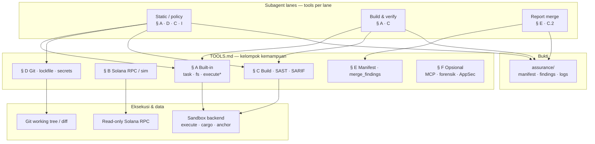

# Integration tool list — `deepagentsjs` + Assurance Run (Solana Security)

**Version 0.1** — Daftar ini merencanakan **tools** (callable by the agent) dan **bukan** middleware inti (`createFilesystemMiddleware`, `createSkillsMiddleware`, dll.). Beberapa entri adalah **wrapper CLI** yang diekspos sebagai satu tool; implementasi sebenarnya memakai backend sandbox untuk `execute` bila berisiko.

### SDLC dan Lean Six Sigma — tool sebagai **Measure** dan **Control**

Tool menghasilkan **bukti** (exit code, SARIF, log) yang mengisi manifest `assurance/`. Dalam **SDLC**, § **A–D** dan **C** mendukung **verifikasi implementasi** (statis + build + dependensi); § **E** menutup siklus dengan **satu catatan terpadu** untuk tinjauan rilis. Dalam **DMAIC**, keluaran tool terutama **Measure** (sinyal) dan **Analyze** (bersama skills di [ARCHITECTURE.id.md § 2.6](./ARCHITECTURE.id.md#26-metodologi-audit-skills--subagen)); **Control** adalah kebijakan: `execute` ter-sandbox, skills terversi, HITL, dan CI—lihat [ARCHITECTURE.id.md § 3](./ARCHITECTURE.id.md#3-penjajaran-sdlc-dan-lean-six-sigma).

| Fokus verifikasi SDLC | Kelompok tool (dokumen ini) | Fase LSS (tipikal) |
|------------------------|----------------------------|---------------------|
| Analisis statis, kebijakan, rantai pasokan | § A, D, § C (SAST, `cargo audit`), § I | Measure → Analyze |
| Build, uji, fuzz | § A, § C | Measure |
| Temuan tergabung + manifest | § E | Measure (artefak) + **Control** (jejak audit) |
| Digest opsional / UI operator | Bukan tool biner — lihat [docs/DASHBOARD-UX.id.md](./docs/DASHBOARD-UX.id.md) | Control (akuntabilitas) |

---

## High-level architecture (tools)

Di layer ini, **tools** adalah antarmuka yang dapat dipanggil agen (subagen) untuk menghasilkan **bukti** (log, SARIF, exit code). Mereka duduk **di bawah** orkestrator dan **di atas** infrastruktur eksekusi (sandbox, RPC read-only, git). Gambaran kontrol penuh (trigger → subagen → HITL): **[ARCHITECTURE.id.md § 1](./ARCHITECTURE.id.md#1-arsitektur-tingkat-tinggi)**.

Penandatanganan, deploy, dan penyimpanan kunci **bukan** tool default — lihat **§ G** di bawah.

**Alur singkat:** orkestrator merencanakan panggilan tool; **build / CLI** (`§ C`) hampir selalu melalui **sandbox**; **Solana** (`§ B`) tetap **read-only** kecuali kebijakan eksplisit; **gabungan temuan** (`§ E`) menormalisasi keluaran beberapa alat (termasuk SARIF dari `§ C.2`). **§ F** adalah perpanjangan non-MVP (forensik, jaringan, skills pihak ketiga). **§ G** mengingatkan kemampuan yang **sengaja tidak** dijadikan tool default.

| Kelompok | Peran dalam Assurance Run | Risiko eksekusi |
|----------|---------------------------|-----------------|
| **§ A** | Delegasi, filesystem, `execute` | `execute` → sandbox |
| **§ B–C** | Bukti program Solana + statis / build | CLI → sandbox; RPC → read-only |
| **§ D** | Cakupan perubahan & dependensi | Rendah (baca repo) |
| **§ E** | Satu bundel temuan + manifest | Tulis `assurance/` |
| **§ F–F.5** (termasuk **§ F.0 MCP**) | Jalur opsional / niche | Kebijakan per tool; MCP: § F.0 |
| **§ I** | Skills metodologi (bukan binary) | Ikuti [REFERENCES.md](./REFERENCES.id.md) |

---

## A. Sudah / bawaan dari deepagents (tanpa integrasi kustom)

| Tool / kemampuan | Sumber | Peran dalam Assurance Run |
|------------------|--------|---------------------------|
| `task` | Built-in subagent | Delegasi ke **static-policy**, **build-verify**, **merge-report** |
| `write_todos` | `todoListMiddleware` | Langkah run terlacak |
| `read_file`, `write_file`, `ls`, `glob`, `grep`, … | `createFilesystemMiddleware` | Baca kode, tulis `assurance/*`, pindai pola |
| `execute` | `createFilesystemMiddleware` + **SandboxBackendProtocol** | `cargo`, `anchor`, skrip — **hanya** jika backend = sandbox |
| Memori / ringkas | `createSummarizationMiddleware`, opsi memory | Log panjang CI |

*Catatan:* Nama tool filesystem persis mengikuti versi `deepagentsjs` yang Anda paketkan; cek `FILESYSTEM_TOOL_NAMES` di repo.

---

## B. Solana & Anchor (kustom — direkomendasikan)

| Tool (nama konseptual) | Input utama | Output | Catatan integrasi |
|------------------------|-------------|--------|-------------------|
| `solana_rpc_read` | method JSON-RPC, params | Hasil RPC | **Read-only** endpoint; tanpa kunci penandatanganan. Lihat [REFERENCES.md](./REFERENCES.id.md) (Helius RPC, praktik aman). |
| `simulate_transaction` | wire tx atau instruksi terencode | Simulasi err / logs | Opsional; tetap **tanpa** broadcast jika policy read-only |
| `anchor_idl_diff` | path IDL lama vs baru | Diff terstruktur | Untuk regresi antar commit |
| `parse_program_logs` | stdout `anchor test` / validator | Ringkasan error | Gabungkan dengan subagen build |

---

## C. Build, uji, analisis statis (wrapper CLI / API)

| Tool | Perintah / API underlying | Lane |
|------|---------------------------|------|
| `cargo_clippy` | `cargo clippy -- -D warnings` (sandbox) | Build-verify |
| `cargo_audit` | `cargo audit` | Static-policy / supply chain |
| `anchor_build` | `anchor build` | Build-verify |
| `anchor_test` | `anchor test` | Build-verify |
| `cargo_test_program` | `cargo test -p <crate>` | Build-verify |

*Alternatif / pelengkap (pilih sesuai kebijakan):*

| Tool | Fungsi |
|------|--------|
| **Trident** (CLI) | Fuzzing bermandat untuk Anchor — eksekusi di sandbox |
| **Sec3 X-ray** atau pemindai sejenis | Analisis statis khusus Solana — jika ada API/CLI stabil, bungkus jadi satu tool |
| **Semgrep** | Aturan kustom Rust/Anchor — `semgrep --config ...` |
| **CodeQL** | Analisis semantik → SARIF — lihat § C.2 |

### C.1 Katalog ekosistem (kurasi cepat)

Tabel di bawah ini **bukan** daftar wajib MVP; gunakan untuk merencanakan integrasi, **skills**, atau konteks manusia. Verifikasi lisensi, syarat API, dan pembaruan upstream sebelum mengandalkan di produksi.

| Nama | Peran | Sumber | Catatan Assurance Run |
|------|--------|--------|------------------------|
| **Trident** (Ackee) | Fuzzing Anchor | [Ackee-Blockchain/trident](https://github.com/Ackee-Blockchain/trident) · [dokumentasi](https://ackee.xyz/trident/docs/) | Jalankan di **sandbox**; cocok dengan lane fuzz / property checks. |
| **Anchor Test UI** (visual / IDL) | UI untuk memanggil instruksi dari IDL | [blockchain-hq/testship](https://github.com/blockchain-hq/testship) · [0xPratik/anchor-UI](https://github.com/0xPratik/anchor-UI) | Mempercepat eksplorasi manual; **bukan** pengganti `anchor test` otomatis di CI. |
| **APR** (Anchor Program Registry) | Registry program Anchor terverifikasi | [apr.dev](https://apr.dev) · [coral-xyz/apr-ui](https://github.com/coral-xyz/apr-ui) | Konteks due diligence sumber terbuka / IDL publik. |
| **checked-math** (Blockworks) | Makro aritmetika terperiksa | [blockworks-foundation/checked-math](https://github.com/blockworks-foundation/checked-math) | Mengurangi risiko overflow; tetap review domain bisnis. |
| **cargo-audit** | `Cargo.lock` vs advisory (RustSec) | [RustSec / cargo-audit](https://github.com/rustsec/rustsec/tree/main/cargo-audit) | Selaras §C; keluaran untuk lane supply chain. |
| **cargo-geiger** | Statistik penggunaan `unsafe` | [rust-secure-code/cargo-geiger](https://github.com/rust-secure-code/cargo-geiger) | Signal saja; tidak setara pembuktian kerentanan. |
| **Semgrep + Rust/Solana** | SAST berbasis aturan | [Semgrep](https://semgrep.dev/); dukungan Rust (riset): [Kudelski Security](https://research.kudelskisecurity.com/2021/04/14/advancing-rust-support-in-semgrep/) | Gabungkan aturan komunitas / kustom Anchor; kurangi FP dengan review. |
| **Solana PoC Framework** (Neodyme) | Kerangka PoC / eksploit uji | [neodyme-labs/solana-poc-framework](https://github.com/neodyme-labs/solana-poc-framework) | Hanya dengan **ruang lingkup bug bounty / izin tertulis**; bukan mode default agen. |
| **sol-ctf-framework** (OtterSec) | Lingkungan tantangan Solana (CTF) | [otter-sec/sol-ctf-framework](https://github.com/otter-sec/sol-ctf-framework) | Pelatihan dan reproduksi terkendali; bukan jalur audit produksi. |
| **Vipers** (Saber) | Pengecekan & validasi akun (crate) | [saber-hq/vipers](https://github.com/saber-hq/vipers) | Pola bantu untuk Anchor; tetap verifikasi logika bisnis. |
| **Sec3** (X-Ray / Auto Auditor) | Pemindai kerentanan Solana (layanan) | [sec3.dev](https://www.sec3.dev/) · [dokumentasi](https://doc.sec3.dev/) | Bungkus sebagai tool **opsional** jika ada API/CLI dan token; SARIF jika disediakan. |
| **L3X** | SAST + LLM untuk Rust/Solana & Solidity | [VulnPlanet/l3x](https://github.com/VulnPlanet/l3x) | Perlu kunci model/API; anggap temuan **kandidat** sampai diverifikasi. |
| **RugCheck** (dan alat risiko token sejenis) | Heuristik **token** / likuiditas (bukan audit program) | [rugcheck.xyz](https://rugcheck.xyz/) | Konteks memecoin / LP; **tidak** menggantikan review `programs/` Rust. |

### C.2 CodeQL & SARIF (analisis statis mendalam & pertukaran temuan)

**CodeQL** membangun **database** dari sumber, lalu menjalankan **kueri** analisis (alur data, pola keamanan). Dokumentasi: [codeql.github.com/docs](https://codeql.github.com/docs/). Untuk Assurance Run, anggap sebagai **opsional non-MVP**: membutuhkan `codeql` CLI, waktu build, dan disk — jalankan di **sandbox** atau CI terpisah.

| Aspek | Catatan |
|--------|---------|
| **Output** | Hasil standar ke **SARIF** untuk konsumsi `merge_findings`, GitHub Code Scanning, atau **audit-augmentation** (Trailmark). |
| **Kualitas** | “Database terbuat” ≠ ekstraksi sempurna; verifikasi cakupan sebelum melaporkan bersih. |
| **Suite kueri** | Gunakan **referensi suite eksplisit** (`.qls`); hindari mengandalkan filter bawaan paket tanpa audit. |
| **Model kustom** | *Data extensions* untuk API / *wrapper* proyek — sering diperlukan agar sumber/sink terdeteksi. |
| **Rust / Solana** | Konfirmasi dukungan bahasa dan paket untuk **Rust** di versi CodeQL Anda; padukan dengan Semgrep/Trident untuk celah spesifik SVM. |

**SARIF** ([OASIS SARIF 2.1.0](https://docs.oasis-open.org/sarif/sarif/v2.1.0/sarif-v2.1.0.html)) adalah format umum untuk **runs**, **results**, lokasi berkas, dan metadata aturan. Dipakai untuk menggabungkan temuan dari beberapa alat, membandingkan baseline PR, dan makanan ke graf (setelah parsing).

| Aspek | Catatan |
|--------|---------|
| **`merge_findings`** | Implementasi dapat menerima satu atau beberapa berkas `.sarif` + temuan agen; **normalisasi path** dan **fingerprint** membantu deduplikasi. |
| **Alat** | `jq`, [sarif-tools](https://github.com/microsoft/sarif-tools), atau skrip internal — bukan eksekusi pemindaian. |
| **Besar berkas** | Untuk SARIF sangat besar, pertimbangkan streaming / pemrosesan berchunk. |

Rujukan latar belakang: [REFERENCES.md — CodeQL & SARIF](./REFERENCES.id.md).

---

## D. Repositori, dependensi, rahasia

| Tool | Fungsi |
|------|--------|
| `git_diff_summary` | `git diff base..head --stat` / daftar file |
| `lockfile_parse` | Ringkasan `Cargo.lock` / `pnpm-lock` untuk diff dependensi |
| `secret_scan` (opsional) | Integrasi **gitleaks**, **trufflehog**, atau API CI — satu tool “jalankan pemindaian” |

---

## E. Orkestrasi & keluaran

| Tool | Fungsi |
|------|--------|
| `write_assurance_manifest` | Menulis `assurance/run-<sha>.json` (versi tool, exit code, hash) |
| `merge_findings` | Menggabungkan temuan dari subagen; dapat mengingest **SARIF 2.1.0** (CodeQL, Semgrep, dll.) — lihat § C.2 |

---

## F. Opsional lanjutan (fase berikutnya)

| Tool | Fungsi |
|------|--------|
| **MCP** (lihat **§ F.0**) | Server eksternal **Model Context Protocol** (intel RPC Solana, API ter-host, dll.) yang dihubungkan oleh **IDE / runner** — bukan tool bawaan `deepagents` kecuali Anda membungkus panggilan dalam tool kustom |
| **Helius / QuickNode** API | Harga, metadata program — hanya jika relevan untuk konteks audit |
| **Issue tracker** | Buat tiket temuan (GitHub API) — **butuh** token terpisah dan HITL |

### F.0 Model Context Protocol (MCP) — integrasi host

**MCP** mengekspos kemampuan eksternal (API, basis data, kueri chain) sebagai **tool terstruktur** ke klien yang mendukung protokol (mis. Claude Code, Cursor). **Ortogonal** dengan permukaan tool bawaan `deepagents` (**§ A**): Anda mengonfigurasi **server MCP di host**, bukan di dalam manifest Assurance Run. Ringkasan resmi: [Model Context Protocol](https://modelcontextprotocol.io/).

| Perhatian | Panduan |
|-----------|---------|
| **Peran dalam Assurance Run** | Gunakan MCP untuk memberi **operator** atau **agen terikat IDE** akses langsung ke RPC Solana **read-only**, pencarian dokumen, atau sistem tiket — tetap tunduk pada **kebijakan** (tanpa kunci penandatanganan di prompt; sandbox untuk apa pun yang menyerupai shell). |
| **Transport** | **stdio** (lokal `npx`/binary), **SSE** / **HTTP** / **WebSocket** (URL ter-host). Utamakan **HTTPS** / **WSS** untuk server jarak jauh. |
| **Konfigurasi** | Biasanya **`.mcp.json`** (atau pengaturan MCP khusus host): `command` + `args` untuk stdio, atau `url` + `headers` untuk HTTP/SSE — gunakan **variabel lingkungan** untuk rahasia (`${API_KEY}`), jangan literal yang di-commit. |
| **Penemuan tool** | Setelah terhubung, tool muncul dengan nama yang dapat diprediksi (mis. `mcp__<server>__<tool>`). **Izinkan dulu** ID tool spesifik di perintah/alur kerja; hindari wildcard `*` untuk produksi. |
| **Solana / Helius** | Jika mengekspos tool chain melalui MCP, selaraskan dengan **`§ B`**: RPC **read-only**, **tanpa** penandatanganan mainnet; batasi rate dan proxy kunci **di sisi server** bila API yang mendasarinya membutuhkan kunci (lihat dokumen keamanan produk untuk pola Helius/Phantom). |
| **Multi-server** | Komposisikan beberapa server MCP hanya jika masing-masing **terbatas ruang lingkup** (*least privilege*) dan **terdokumentasi** untuk tim. |

**Indeks dokumen (ekosistem LangChain):** [docs.langchain.com — llms.txt](https://docs.langchain.com/llms.txt) (termasuk halaman platform terkait MCP). **Pola Claude Code / plugin:** bundel server di `.mcp.json`, gunakan `${CLAUDE_PLUGIN_ROOT}` untuk path portabel, dokumentasikan `env` yang diperlukan di plugin atau README repo.

---

## F.1 Analisis biner / forensik (opsional, **non-MVP**)

Untuk artefak **tanpa sumber** atau investigasi **supply chain** (lib native, malware, blob)—**bukan** untuk audit rutin **Rust/Anchor** di repositori.

| Tool (konseptual) | Underlying | Prasyarat | Catatan |
|-------------------|------------|-----------|---------|
| `ghidra_headless` / `analyze_binary` | [Ghidra](https://github.com/NationalSecurityAgency/ghidra) SRE (disassembly, decompiler, skrip Java/Python) | **JDK 21**, rilis resmi atau build; jalankan hanya di **sandbox** / VM terisolasi | Berat (JVM, artefak besar); ikuti [Security Advisories](https://github.com/NationalSecurityAgency/ghidra) proyek Ghidra sebelum produksi |
| Alur alternatif | `strings`, `file`, pemindaian hash | Minimal | Untuk triase cepat sebelum Ghidra |

**Kebijakan:** default **mati**; aktifkan per properti bila tim punya kasus penggunaan dan kuota compute. Jangan pasangkan dengan repositori yang memuat **rahasia** dalam biner.

---

## F.2 Skill SAST berbasis LLM (opsional)

[llm-sast-scanner](https://github.com/SunWeb3Sec/llm-sast-scanner) adalah **skill** (bukan binary CLI) untuk agen koding: alur **source → sink** / taint, verifikasi **Judge**, dan **34 kelas** kerentanan (injeksi, auth, SSRF, deserialization, dll.). Bahasa yang dijelaskan di upstream: **Java, Python, JavaScript/TypeScript, PHP, .NET** — **bukan** aturan khusus **Rust / program Solana on-chain**.

| Peran | Catatan |
|-------|---------|
| **Monorepo** | Cocok untuk **layanan off-chain** dalam repo yang sama (API, indexer, admin web) bersama `programs/`. |
| **Bukan pengganti** | **Trident**, **Semgrep** Rust/Anchor, atau **solana-dev-skill** tetap jalur utama untuk bytecode / program. |
| **Integrasi** | Pasang folder skill ke path yang dibaca `createSkillsMiddleware` (lihat README upstream); jalankan **beberapa putaran** pemindaian + validasi per-temuan bila memungkinkan. |

**Kebijakan:** anggap keluaran sebagai **temuan kandidat**; sesuaikan severity dengan kebijakan tim dan **jangan** menggabungkan otomatis dengan manifest assurance on-chain tanpa review.

---

## F.3 Trail of Bits — skills ([skills.sh](https://skills.sh))

[Katalog Trail of Bits](https://skills.sh/trailofbits) menyediakan **skills** siap pasang untuk asisten kode (analisis keamanan, fuzzing, alat statis, dan lainnya). Contoh nama yang sering dipakai bersama assurance umum: **trailmark-summary**, **fuzzing-dictionary**, **wycheproof** — bervariasi menurut rilis di situs.

| Peran | Catatan |
|-------|---------|
| **Pelengkap** | Cocok untuk **lintasan C/C++/Rust umum**, workflow audit, dan persiapan fuzzing — **bukan** spesifik program Solana/Anchor. |
| **Solana** | Tetap sandarkan checklist dan tooling chain pada **solana-dev-skill** + §B–§C di dokumen ini. |
| **Integrasi** | Unduh/pasang dari [skills.sh](https://skills.sh) sesuai dokumentasi upstream; muat dengan **`createSkillsMiddleware`**; batasi skill yang memicu eksekusi perintah ke **sandbox**. |

Rincian dan pembaruan daftar: [REFERENCES.md — Trail of Bits](./REFERENCES.id.md).

---

## F.4 Project Discovery & Wireshark (opsional — **off-chain / jaringan**)

Alat ini **bukan** bagian MVP audit **Rust/Anchor** di repositori; dipakai bila Assurance Run diperluas ke **permukaan serangan** (API, web, DNS) atau **debug protokol** dengan izin.

### Project Discovery

[ProjectDiscovery](https://projectdiscovery.io/) menyediakan CLI (mis. **Nuclei**, **httpx**, **Subfinder**, **Naabu**, **Katana**, **dnsx**, **Interactsh**, **cvemap**, **PDTM**) untuk penemuan aset dan pemindaian berbasis templat. Indeks dokumentasi untuk asisten: [docs.projectdiscovery.io/llms.txt](https://docs.projectdiscovery.io/llms.txt).

| Peran | Catatan |
|-------|---------|
| **dApp / backend** | Cocok untuk memverifikasi **endpoint** yang Anda deploy (staging/produksi dengan izin), bukan untuk “menguji” RPC publik sembarangan. |
| **Tool wrapper** | Satu tool konseptual `nuclei_run` / `httpx_probe` yang memanggil binary di **sandbox** dengan daftar host dari variabel **policy** (bukan dari prompt bebas). |
| **Legal / ToS** | Hanya sasaran dalam **ruang lingkup tertulis**; larangan pemindaian melawan sistem pihak ketiga tanpa otorisasi. |

### Wireshark

[Wireshark](https://www.wireshark.org/) menangkap dan menganalisis paket (mis. [alur kerja Wireshark](https://www.wireshark.org/docs/wsdg_html_chunked/ChWorksOverview.html): GUI, **Epan**, **Wiretap**, capture). Panduan pengguna: [dokumentasi Wireshark](https://www.wireshark.org/docs/).

| Peran | Catatan |
|-------|---------|
| **Integrasi / insiden** | Memahami JSON-RPC, TLS, atau WebSocket pada host yang Anda kendalikan. |
| **Artefak** | File `.pcap` dapat berisi **rahasia** — simpan di penyimpanan privat; jangan mengunggah ke repo atau memasukkan isi paket ke prompt LLM tanpa redaksi. |

Rujukan lengkap: [REFERENCES.md — Project Discovery & Wireshark](./REFERENCES.id.md).

---

## F.5 ExploitDB / `searchsploit` (opsional — **intel publik**)

[Exploit Database](https://www.exploit-db.com/) adalah arsip PoC publik; di banyak distro (mis. [Kali — paket `exploitdb`](https://www.kali.org/tools/exploitdb/)) tersedia CLI **`searchsploit`** untuk pencarian lokal (`searchsploit -h`, pembaruan `searchsploit -u`, filter `--cve`, `--nmap`, dll.).

| Peran | Catatan |
|-------|---------|
| **Threat intel** | Mencocokkan **CVE / produk / versi** pada stack yang relevan (server, dependensi native) dalam ruang lingkup yang sah. |
| **Bukan inti Solana** | Tidak menggantikan audit **Rust/Anchor** atau bukti matematis; banyak entri tidak relevan untuk SVM. |
| **Integrasi agen** | Jika dibungkus sebagai tool, jalankan **read-only search** di sandbox; **larang** eksekusi PoC otomatis dari agen; wajib **HITL** sebelum menjalankan kode exploit apa pun. |

**Kebijakan:** eksploitasi tanpa izin adalah **ilegal**; PoC hanya di lingkungan **izin tertulis** atau lab terisolasi. Lihat [REFERENCES.md — ExploitDB](./REFERENCES.id.md).

---

## G. Yang sengaja *bukan* tool default

| Kemampuan | Alasan |
|-----------|--------|
| Penandatanganan transaksi | Keluar dari loop agen; **HITL** atau layanan khusus |
| Deploy program mainnet | Sama |
| Menyimpan *private key* | Tidak pernah sebagai argumen tool |

---

## H. Urutan integrasi yang disarankan (MVP → lanjut)

1. **Filesystem + `execute` (sandbox)** + `git_diff` wrapper  
2. **`cargo_clippy` / `anchor build` / `anchor test`**  
3. **`solana_rpc_read`** (read-only)  
4. **`cargo audit` + aturan Semgrep** minimal  
5. Trident / pemindai statis khusus Solana saat kebijakan jelas  
6. *(Opsional)* Ghidra headless / analisis biner hanya untuk jalur forensik yang sudah disetujui  
7. *(Opsional)* Skill **llm-sast-scanner** jika repo menyertakan layanan **TS/JS/Python/Java** off-chain yang perlu SAST terstruktur  
8. *(Opsional)* Skills **[Trail of Bits](https://skills.sh/trailofbits)** (fuzzing, trailmark, Wycheproof, dll.) sesuai kebijakan tim — lihat § F.3  
9. *(Opsional)* **[ProjectDiscovery](https://projectdiscovery.io/)** / **Wireshark** hanya untuk jalur **AppSec / jaringan** dengan sasaran berizin — lihat § F.4  
10. *(Opsional)* **`searchsploit`** / **ExploitDB** hanya untuk **intel CVE** berizin — **bukan** eksekusi PoC otomatis — lihat § F.5  
11. *(Opsional)* **Server MCP** di IDE/host untuk bantuan chain atau API **read-only** — lihat § F.0  
12. *(Opsional)* **Metodologi audit** (recon, konteks, pola Solana, augmentasi SARIF, *zeroize*, dll.) — lihat § I  
13. *(Opsional)* **CodeQL** → **SARIF** + parsing/merge (monorepo / bahasa yang didukung) — lihat § C.2  

---

## I. Metodologi audit & skills (opsional)

Bagian ini **bukan** daftar executable di PATH; memetakan **alur kerja manusia / skill agen** ke subagen Assurance Run. Tabel lengkap dengan penjelasan per skill: **[REFERENCES.md — Metodologi audit & agent skills](./REFERENCES.id.md)**.

| Fase | Metodologi (contoh nama skill) | Subagen / output |
|------|--------------------------------|------------------|
| **Recon** | CodeRecon (*zz-code-recon*) | Ringkasan arsitektur & trust boundary → konteks orchestrator |
| **Konteks mendalam** | *audit-context-building* | Model invarian sebelum pencarian kerentanan |
| **Persiapan** | *audit-prep-assistant* | Artefak pra-audit (build, cakupan, dokumen) — sering **manual** atau CI |
| **Pemindaian Solana** | *solana-vulnerability-scanner* | Lane **static-policy** — 6 pola platform (CPI, PDA, …) |
| **Footgun & varian** | *vulnhunter* | Triage temuan berulang; melengkapi Semgrep |
| **Graf + temuan** | *audit-augmentation* (+ Trailmark) | SARIF/weAudit diproyeksikan ke graf; butuh **preanalysis** |
| **CodeQL / SARIF** | *codeql* + *sarif-parsing* | DB + kueri → SARIF; agregasi & dedupe sebelum merge / augment — [§ C.2](./TOOLS.id.md) |
| **Visual** | *diagramming-code* | Diagram dari Trailmark — untuk review manusia |
| **Kripto / memori** | *zeroize-audit* | Jalur khusus; toolchain berat |
| **Orkestrasi** | *deep-agents-orchestration* | Selaras **task** / **write_todos** / **interruptOn** — lihat [ARCHITECTURE.md](./ARCHITECTURE.id.md) |
| **Maturitas kode** | *code-maturity-assessor* | Scorecard 9 kategori (ToB-style) → prioritas perbaikan |
| **Kepatuhan spec** | *spec-to-code-compliance* | Whitepaper/desain ↔ implementasi; membutuhkan korpus dokumen + kode |
| **Varian aturan Semgrep** | *semgrep-rule-variant-creator* | Port aturan ke bahasa lain dengan tes; melengkapi §C Semgrep |
| **Rantai pasokan** | *supply-chain-risk-auditor* | Laporan risiko repo dependensi (`gh`); melengkapi §D lockfile / `cargo audit` |
| **CI / infrastruktur** | *devops* | Pipeline runner agen, sandbox, penyimpanan artefak — terpisah dari subagen audit |
| **API off-chain** | *api-development* | NestJS / Go — selaras §F.2 untuk layanan web di repo yang sama |
| **Deteksi artefak (YARA-X)** | *yara-rule-authoring* | Aturan `yr` untuk sampel berbahaya / pola supply chain — niche; bukan inti Solana |
| **Model ancaman** | *security-threat-model* | Model AppSec berbasis bukti → opsional `*-threat-model.md`; melengkapi recon / *merge-report* |
| **Keselamatan operator & agen** | *security-awareness* | Higiene URL/kredensial sebelum browse atau bagikan — lapisan kebijakan, bukan SAST |
| **Desain API aman** | *security-best-practices* | Berpasangan dengan *api-development* untuk layanan off-chain; kontrol waktu desain |

**Kebijakan:** sandarkan keputusan severity pada **bukti** (log tool, tes, graf); skills yang memicu eksekusi berbahaya tetap di belakang **HITL** atau policy. **security-awareness** mengurangi risiko **social engineering dan kebocoran rahasia** di alur agen; bukan pengganti pemindaian kode.

---

*Sesuaikan nama tool dengan konvensi `deepagents` (hindari bentrok dengan `BUILTIN_TOOL_NAMES`).*
