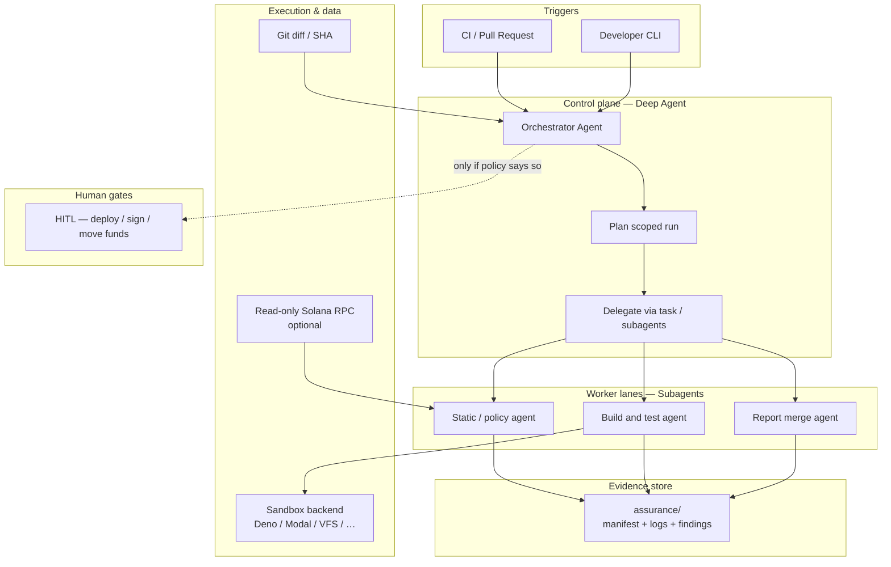
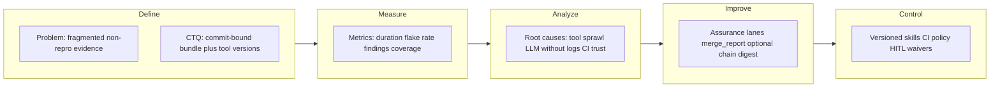
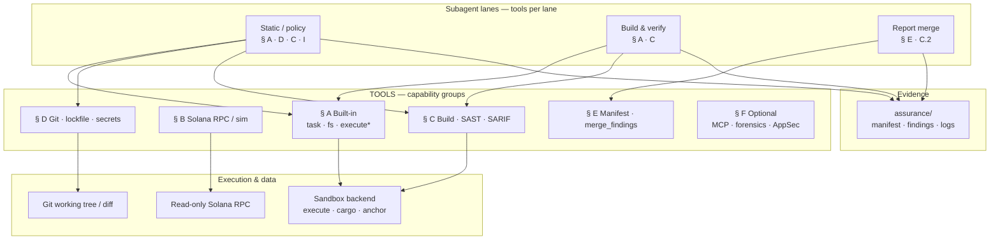

# Assurance Run: Reproducible Security Orchestration for Solana Development

**Product: ARES Solana Security Tool (ASST)** · **Version 0.1** — April 2026 · [Bahasa Indonesia](./WHITEPAPER.id.md)

---

## Executive summary

This document describes **Assurance Run**, a security orchestration layer built on **deepagentsjs** (LangGraph-based controllable agents) for teams shipping **Solana / Anchor** programs. The goal is not a one-off “AI score” but a **bundle of evidence** bound to a **git commit**: commands executed, tool versions, redacted logs, and findings that can be re-audited. The approach targets common failure modes in AI–blockchain integration—**solution jumping**, **misplaced technology**, and **uninformed design**—by separating roles (analysis vs sandbox execution), keeping signing keys out of the default agent loop, and encoding security policy as **versioned skills**.

---

## Abstract

Solana teams ship fast; security tooling often fragments across static scanners, fuzzers, LLM chat assistants, and periodic manual audits. None of these alone produces **traceability** strong enough for what was checked **before** a change merged. Assurance Run proposes a **deep-agent orchestration layer**—implemented with **deepagentsjs**—that runs **layered checks** on each meaningful change, persists **evidence artifacts** (manifests, logs, exit codes) tied to a **git SHA**, and uses **subagents**, **sandboxed execution**, and optional **human-in-the-loop** for high-risk actions. This whitepaper states the problem, value proposition, differentiation, market context, and honest non-goals.

---

## 1. Problem

### 1.1 Fragmentation and non-reproducibility

Security work on Solana programs spans Rust/Anchor correctness, account validation, CPI graphs, dependency and CI hygiene, and—when AI is involved—prompt injection and tool misuse. One-off LLM reviews rarely attach **command history**, **tool versions**, and **deterministic reproduction** to a specific commit. Without that bundle, organizations cannot answer: **What ran? On what SHA? What failed? Who waived it?**

### 1.2 Misapplied metaphors and controls

Three interacting pressures—**AI safety** (alignment and tool misuse), **AI for security** (detection and triage), and **security for AI** (keys, runtime, CI)—create prioritization tension. Tools built for one layer are often **misplaced** at another (for example, bytecode-only analysis cannot resolve governance or social-engineering failures).

### 1.3 Solana-specific complexity

High throughput and composability increase operational risk: account model semantics, PDA validation, signer checks, CPI and remaining accounts, and Token-2022 transfer hooks require **scenario-aware** testing and explicit invariants—not only generic static rules imported from EVM-centric habits.

---

## 2. Solution: Assurance Run

**Assurance Run** is a product pattern, not a single model: a **deep agent** workflow that:

1. **Plans** a scoped run (diff-aware, risk-tiered).
2. **Delegates** to **subagents** with narrow mandates (for example, dependency diff analysis, policy checks, sandbox build and test).
3. **Persists** outputs into repository-attached artifacts (`assurance-run.json`, `findings.md`, hashed logs).
4. **Gates** dangerous operations with **human-in-the-loop** where appropriate (deployment, signing, fund movement).
5. Emits a **single Assurance Report** suitable for internal review or external audit preparation.

The emphasis is **evidence-first**: competitors optimize for scores or chat; Assurance Run optimizes for **reproducibility** and **diff-aware scope**.

### 2.1 Operational excellence: DMAIC and release accountability

Software supply-chain risk and high-impact incidents show that assurance is not only “bugs in the program”—it includes **dependencies**, **keys**, and **governance**. Teams still struggle to produce **one reproducible, mergeable record** that static checks and tests ran before a release, and to show **accountability** to stakeholders.

**Lean Six Sigma**’s **DMAIC** (Define, Measure, Analyze, Improve, Control) gives a disciplined loop for that pipeline: **Define** CTQs (commit-bound manifest, tool versions); **Measure** via exit codes, SARIF, and test results in `assurance/`; **Analyze** with skills mapped to subagents ([§ 9.2.6](#926-audit-methodology-skills--subagents)); **Improve** rules, sandboxes, and merged outputs; **Control** with versioned skills, HITL, and CI policy. **SDLC** phases (plan → operate) align to the same artifacts—see [§ 9.3](#93-sdlc-and-lean-six-sigma-alignment).

An optional **on-chain digest** of a merged evidence hash (for example devnet MVP) can tie a wallet-signed action to a specific run—raising the **transparency floor** without replacing professional audits. Recommended payload fields and UI principles: [docs/DASHBOARD-UX.en.md](./docs/DASHBOARD-UX.en.md).

---

## 3. Why deepagentsjs

The **ASST** workspace vendors **deepagentsjs**, a TypeScript **LangGraph**-based harness providing:

- **Planning and task decomposition** for long-horizon pipelines.
- **Sub-agent architecture** to separate incompatible tasks (reasoning vs sandbox execution).
- **Filesystem and skills middleware** so security policy lives as **versioned** artifacts, not ephemeral system prompts.
- **Sandbox backends** (for example Deno, Modal, QuickJS, VFS—see `deepagentsjs/examples/sandbox/`) so builds and scripts need not run raw on the developer host.
- **Tool-call parity middleware** and related robustness patterns for reliable CI integration.

Solana-specific logic (Anchor builds, RPC read tools, custom linters) is supplied as **tools and skills** on top of this harness—not inside the core library.

---

## 4. Value proposition and unique selling points

| Dimension | Assurance Run positioning |
|-----------|---------------------------|
| **Outcome** | Reproducible **evidence bundle** per meaningful change, not a one-off AI verdict. |
| **Architecture** | **Orchestration** across static signals, sandboxed execution, and policy; not a single generic scanner. |
| **Trust model** | Explicit **non-goals** and **waivers** with audit trail; optional HITL for irreversible actions. |
| **Differentiation** | **Noise reduction** layer that clusters duplicates and demotes LLM output unless tied to a tool finding or repro. |

---

## 5. Market landscape and competitor matrix

The market spans multiple boxes; Assurance Run **orchestrates** across them rather than replacing each specialist tool.

| Category | Typical focus | Typical strength | Contrast vs Assurance Run |
|----------|---------------|------------------|----------------------------|
| AI audit chat | Quick suggestions | Low friction | Weak **commit-bound** evidence and **multi-step** governance |
| Static / pattern scanners | Known vulnerability classes | Fast at scale | Needs **orchestration** and **Solana-aware** policy |
| Fuzzers / harness frameworks | Logic bugs, edge cases | Strong repro | Requires **harness authoring**; agent assists, does not replace oracles |
| Manual audit firms | Depth, reputation | High assurance | **Snapshot**-based; not **continuous** per PR |
| On-chain monitoring | Runtime abuse | Live visibility | Complements but does not fix **pre-deploy** code defects |
| Wallet / signing policy | Key protection | Reduces theft | Different layer from **program** assurance |
| Generic CI SAST / secrets | Broad repos | Wide coverage | Lacks default **Anchor/SVM semantics** without custom skills |

---

## 6. Non-goals

- **Formal verification** is not claimed unless a real prover runs with explicit **assumptions** and **scope**.
- **Governance, social engineering, and key compromise** are not “solved” by program analysis alone; they require **process** and **operational** controls.
- **Autonomous deployment** or **custodial** keys for agents are **out of scope** for the default posture.

---

## 7. Risks

- **Toolchain churn** (Anchor/Rust) requires maintained **skills** and **test matrices**.
- **False positives** from LLM-assisted steps can train teams to ignore findings unless **triage** and **severity calibration** are first-class.
- **Dual-use**: orchestration that runs powerful tools must default to **least privilege** and **sandboxed** execution.

---

## 8. Implementation note (ASST)

The repository contains **deepagentsjs** as an **agent harness** (see `deepagentsjs/libs/deepagents`, `deepagentsjs/examples/`). A production Solana security vertical adds **custom tools** (for example read-only RPC, `cargo`/`anchor` in sandbox, MCP integrations) and **organizational policy** as skills. This whitepaper describes the **conceptual** product; concrete tool names and deployment diagrams are left for implementation milestones.

---

## 9. Architecture

*This section consolidates the former **ARCHITECTURE.en.md**: control plane, runtime mapping to `deepagentsjs`, trust boundaries, HITL, DMAIC/SDLC, and illustrative pseudocode. Language hub: [ARCHITECTURE.md](./ARCHITECTURE.md) · [ARCHITECTURE.id.md](./ARCHITECTURE.id.md). Related: [§ 10 Integration tools](#10-integration-tools-and-execution-surface) · [§ 11 References](#11-official-references-standards-and-methodology).*

---

### 1. High-level architecture

At this layer, **Assurance Run** is a **control plane** that orchestrates **evidence-producing checks** on a **scoped code change**, then writes a **single report bundle** tied to a **git commit**. Execution of risky commands is isolated; **signing** and **deployment** stay outside the default path.



**Flow (conceptual):**

1. **Trigger** supplies **commit range** or **PR ref**.
2. **Orchestrator** loads **skills** (Anchor/security policy) and builds a **plan** (what to run, in what order, risk tier).
3. **Subagents** run **narrow** jobs: policy/static signals, **sandboxed** compile/test, dedupe/merge.
4. **Artifacts** land under a stable prefix (for example `assurance/`) with **hashes** and **tool versions**.
5. **HITL** is invoked only for **irreversible** or **privileged** actions (never the default loop).

**Tool-layer view:** which callable tools map to which lanes and backends — **[§ 10 — High-level architecture (tools)](#high-level-architecture-tools)**.

---

### 2. Low-level architecture

This maps the product to **`deepagentsjs`** (`ASST/deepagentsjs`): `createDeepAgent`, middleware, backends, and optional **custom tools** for Solana.

#### 2.1 Core runtime

| Concept | Role in Assurance Run | deepagentsjs touchpoint |
|--------|------------------------|-------------------------|
| **Orchestrator** | Single graph entry; owns plan + final merge | `createDeepAgent({ ... })` |
| **Subagents** | Isolated prompts + tools per lane | `subagents: [...]` → `createSubAgentMiddleware` |
| **Policy / skills** | Versioned checklists (Anchor pitfalls, org rules) | `createSkillsMiddleware({ backend, sources })` |
| **Filesystem** | Write `findings.md`, logs, manifests | `createFilesystemMiddleware({ backend })` |
| **Long conversation** | Long CI logs summarized | `createSummarizationMiddleware` |
| **Provider quirks** | Valid tool_call / ToolMessage pairing | `createPatchToolCallsMiddleware` |
| **Task tracking** | Steps visible in UI/logs | `todoListMiddleware()` |
| **Sandbox execution** | `cargo`, `anchor`, scripts not on host | Backend implementing **SandboxBackendProtocol** (see `libs/providers/*`, `examples/sandbox/`) |
| **Interrupt (HITL)** | Pause before sensitive tools (deploy, sign, delete, …) | `interruptOn` + **checkpointer** — see §2.5 |

**Implementation map (TOOLS ↔ code, preset subagents):** [deepagentsjs/docs/TOOLS-MAP.md](deepagentsjs/docs/TOOLS-MAP.md).

Built-in tools include **task** (delegate), **write_todos**, filesystem tools, and optionally **execute** when the backend supports sandboxing.

#### 2.2 Backend topology

- **Default development path:** `StateBackend` or store-backed persistence for **conversation + file** state.
- **Heavy verification path:** a **factory** resolves a **sandbox** backend (Deno / Modal / Daytona / …) for **execute** and isolated FS where configured.
- **Solana read path:** **custom tools** (RPC `getAccount`, simulation, etc.) with **read-only** endpoints; **no** private keys in agent state by default.

#### 2.3 Artifact layout (illustrative)

```
assurance/
  run-{sha-short}.json     # manifest: sha, tool versions, exit codes, file hashes
  findings.md              # human-readable summary
  logs/                    # redacted stdout/stderr fragments
```

#### 2.4 Trust boundaries

| Zone | Trust assumption |
|------|------------------|
| **Orchestrator + LLM** | Untrusted for **facts**; outputs must cite **tool** or **log** |
| **Sandbox** | Untrusted code **execution** contained; resource limits enforced |
| **Read-only RPC** | Integrity depends on **RPC provider**; document endpoint |
| **Secrets** | **Out of band**; not written into `findings.md` or prompts by default |

#### 2.5 Human-in-the-loop (LangGraph)

Deep Agents implement HITL via LangGraph **interrupts**. Official docs: [LangChain — Human-in-the-loop (Deep Agents, JS)](https://docs.langchain.com/oss/javascript/deepagents/human-in-the-loop.md); full index: [docs.langchain.com/llms.txt](https://docs.langchain.com/llms.txt).

| Concept | Behavior |
|--------|----------|
| **`interruptOn`** | Map tool name → `true` (default: approve / edit / reject), `false` (no interrupt), or `{ allowedDecisions: ["approve" \| "edit" \| "reject"] }`. |
| **Checkpointer** | **Required** (e.g. `MemorySaver`) so state survives between pause and **resume**. |
| **`invoke` result** | If interrupted, check `result.__interrupt__` — queue of actions awaiting decisions. |
| **Resume** | `agent.invoke(new Command({ resume: { decisions } }), config)` with the **same** `config.configurable.thread_id` as the first invoke. |
| **Multiple tools** | All actions requiring approval are batched into **one** interrupt; `decisions` must be **in the same order** as `actionRequests`. |
| **`edit`** | Allows changing tool arguments before execution (if `allowedDecisions` includes `"edit"`). |
| **Subagents** | Each subagent may **override** `interruptOn` (e.g. `read_file` requires approval only in a specific subagent). |

For Assurance Run, map risky tools (deploy, sign, RPC broadcast, deleting production artifacts) to **`interruptOn: true`** or `{ allowedDecisions: ["approve", "reject"] }`; leave read-only scans and sandboxed execution without interrupt if policy allows.

#### 2.6 Audit methodology (skills) ↔ subagents

Workflows from audit **skills** (recon, context, prep, **repo threat modeling**, Solana patterns, SARIF augmentation, *zeroize*, diagrams, maturity, spec compliance, Semgrep variants, **operator safety**, **secure API patterns**) can be split across **prompt + skills middleware** on existing subagents — without changing the runtime contract:

| Phase | Primary subagent | Typical skill content |
|------|------------------|----------------------|
| Scope & structure | *static-policy* (early) | CodeRecon, deep context |
| Signals & policy | *static-policy* | Solana 6-pattern scanner, VulnHunter, Semgrep; rule development (*semgrep-rule-variant-creator*) |
| Structured evidence | *merge-report* | Import SARIF/weAudit into graph (augmentation), severity summary |
| Docs ↔ code | *merge-report* or dedicated path | *spec-to-code-compliance* (whitepaper / design vs `programs/`) |
| Maturity / pre-release gate | *merge-report* or human | *code-maturity-assessor* (9-category scorecard) |
| Upstream dependencies | *static-policy* | *supply-chain-risk-auditor* (complements `cargo audit` / lockfile) |
| CI infrastructure | Outside agent graph | *devops* (pipeline, secrets, K8s) |
| Monorepo API | *static-policy* / separate service | *api-development* (Go/NestJS) when relevant |
| Malicious artifacts (niche) | Forensics / ops | *yara-rule-authoring* (YARA-X) — not source audit of `programs/` |
| AppSec threat model | *merge-report* or dedicated | *security-threat-model* (evidence-bound; optional `*-threat-model.md`) |
| Agent / operator safety | Policy + HITL + prompts | *security-awareness* (URLs, credentials, social engineering) — not SAST |
| Secure service design | *static-policy* / off-chain lane | *security-best-practices* with *api-development* |
| Visual / report | *merge-report* or human | Diagrams from Trailmark |

Orchestration of **task** / **write_todos** / **HITL** follows **deep agents** patterns (delegation, planning, approval). Index: **[§ 11 — Audit methodology](#audit-methodology--agent-skills-curated)** and **[§ 10.I](#i-audit-methodology--skills-optional)**. Skill placement in the table below supports **Analyze** and **Improve** in §9.3.

---

### 3. SDLC and Lean Six Sigma alignment

**SDLC** (Software Development Life Cycle) names the phases from requirements to operations. **Lean Six Sigma** here uses **DMAIC** (Define, Measure, Analyze, Improve, Control) to improve the *security-evidence pipeline* itself—complementary to DMADV/DFSS when designing new capabilities (for example merged JSON output or an on-chain digest MVP). This section ties those models to Assurance Run without replacing the low-level design in §2 or the pseudo code in §4.

#### 3.1 DMAIC overlaid on Assurance Run



| Phase | Assurance Run interpretation |
|-------|------------------------------|
| **Define** | Problem and CTQs in [WHITEPAPER.en.md](./WHITEPAPER.en.md) §1: reproducible manifest, git SHA, redacted logs, mergeable findings. |
| **Measure** | Exit codes, SARIF counts, `cargo audit` severity, test pass/fail, run duration—recorded in `assurance/run-*.json` ([§ 10](#10-integration-tools-and-execution-surface)). |
| **Analyze** | Map failure modes to lanes (*static-policy* vs *build-verify* vs *merge-report*); use skills in §2.6. |
| **Improve** | Tighten tool wiring, Semgrep rules, sandbox images; optional **evSec-style** merged JSON and devnet digest ([DASHBOARD-UX.en.md](./docs/DASHBOARD-UX.en.md)). |
| **Control** | Versioned skills, `interruptOn` / HITL (§2.5), immutable CI pins—ongoing governance. |

#### 3.2 SDLC phases × Assurance Run

| SDLC phase | Deliverable |
|------------|-------------|
| **Planning / requirements** | Orchestrator scope rules: what runs on which diff; CTQs from the whitepaper. |
| **Design** | Control plane, subagents, `assurance/` layout; trust boundaries (§2.4). |
| **Implementation** | `deepagentsjs` tools, skills middleware, sandbox backends ([§ 10](#10-integration-tools-and-execution-surface) § A–E). |
| **Test** | `cargo test`, optional fuzz; lanes emit **evidence**, not narrative-only verdicts. |
| **Deploy / release** | HITL for sign/deploy; optional **on-chain digest** of merged output (accountability, not a substitute for audit). |
| **Operate / maintain** | Skill updates, dependency policy, REFERENCES refresh. |

#### 3.3 Cross-reference to §2.6

Audit **skills** mapped in §2.6 align with **Analyze** (signals, threat model, supply chain) and **Improve** (SARIF merge, maturity scorecard, spec compliance). **Measure** is implemented by tool exit codes and manifests; **Control** by HITL and CI policy.

#### 3.4 UI, multi-surface clients, and digest payload

Operator dashboard principles, **CSS variable palette**, **persona × surface** matrix (React, Tauri, CLI, optional TUI), and **recommended default fields** for an optional on-chain digest of merged evidence are documented in **[docs/DASHBOARD-UX.en.md](./docs/DASHBOARD-UX.en.md)** (Indonesian: [DASHBOARD-UX.id.md](./docs/DASHBOARD-UX.id.md)).

---

### 4. Pseudo code

Illustrative only—not a shipping implementation. Names follow **deepagentsjs** concepts (`createDeepAgent`, `subagents`, `tools`).

#### 4.1 Orchestrator setup

```typescript
// Pseudo code — Assurance Run orchestrator

import { createDeepAgent } from "deepagents";
import { tool } from "langchain";
import { MemorySaver } from "@langchain/langgraph";
import { z } from "zod";

// Required if interruptOn is used (human-in-the-loop)
const checkpointer = new MemorySaver();

const solanaReadonlyTool = tool(
  async ({ method, params }) => {
    // POST read-only JSON-RPC; no signing
    return await rpcReadOnly(method, params);
  },
  {
    name: "solana_rpc_read",
    description: "Read-only Solana RPC call.",
    schema: z.object({ method: z.string(), params: z.array(z.unknown()) }),
  },
);

const assuranceAgent = createDeepAgent({
  name: "assurance-run",
  systemPrompt: ASSURANCE_SYSTEM_PROMPT, // skills augment this
  tools: [solanaReadonlyTool /* , cargoAnchorInSandbox, … */],
  skills: ["./skills/solana-anchor-security"], // versioned markdown skills
  backend: sandboxBackendFactory, // resolves to SandboxBackend for execute
  checkpointer, // required when using interruptOn
  interruptOn: {
    deploy_program: true, // default: approve | edit | reject
    sign_transaction: { allowedDecisions: ["approve", "reject"] },
    execute: false, // or true if shell in sandbox should be gated
  },
  subagents: [
    {
      name: "static-policy",
      description: "Static checks, grep policies, dependency diff.",
      systemPrompt: STATIC_SUBAGENT_PROMPT,
      tools: [/* glob, grep, read_file */],
    },
    {
      name: "build-verify",
      description: "Sandboxed cargo clippy, anchor build, targeted tests.",
      systemPrompt: BUILD_SUBAGENT_PROMPT,
      tools: [/* execute — only if backend is sandbox */],
    },
    {
      name: "merge-report",
      description: "Dedupe findings, severity, write assurance/ bundle.",
      systemPrompt: MERGE_SUBAGENT_PROMPT,
    },
  ],
});
```

#### 4.2 Single run (invoke)

```typescript
// Pseudo code — run tied to a commit

import { Command } from "@langchain/langgraph";

async function runAssuranceRun(input: {
  baseSha: string;
  headSha: string;
  repoPath: string;
}) {
  const userMessage = [
    `Run Assurance Run for ${input.baseSha}..${input.headSha}.`,
    `Write manifest to assurance/run-${input.headSha.slice(0, 7)}.json`,
    `and findings to assurance/findings.md.`,
    `Do not sign transactions. Use read-only RPC only.`,
  ].join("\n");

  const config = { configurable: { thread_id: `assurance-${input.headSha}` } };

  let result = await assuranceAgent.invoke(
    { messages: [{ role: "user", content: userMessage }] },
    config,
  );

  // If interruptOn fired: surface actionRequests to a human UI, then:
  // result = await assuranceAgent.invoke(
  //   new Command({ resume: { decisions: [{ type: "approve" }, …] } }),
  //   config, // same thread_id
  // );

  return result;
}
```

#### 4.3 Subagent delegation (conceptual)

```text
ORCHESTRATOR:
  write_todos [ plan static → build → merge ]
  task(subagent="static-policy", task="Diff Cargo.lock + run policy grep + secret scan hints")
  → wait for ToolMessage

  task(subagent="build-verify", task="In sandbox: anchor build, cargo clippy, unit tests")
  → if backend not sandbox: execute tool must be disabled (middleware filters it)

  task(subagent="merge-report", task="Merge deduped findings + write assurance/ bundle")
```

#### 4.4 Safety guard (pseudo)

```typescript
// Pseudo code — refuse high-risk tools without HITL

function beforeToolCall(toolName: string, args: unknown, policy: Policy): GateResult {
  if (policy.readOnly && TOOLS_THAT_MOVE_FUNDS.has(toolName)) {
    return { allowed: false, reason: "Blocked by read-only policy." };
  }
  if (REQUIRES_HITL.has(toolName)) {
    return { allowed: "interrupt", reason: "Requires human approval." };
  }
  return { allowed: true };
}
```

---

### 5. Related paths in this repository

| Path | Relevance |
|------|-----------|
| `deepagentsjs/libs/deepagents/src/agent.ts` | `createDeepAgent`, middleware assembly |
| `deepagentsjs/libs/deepagents/src/middleware/` | Filesystem, skills, subagents, summarization, patch tool calls |
| `deepagentsjs/examples/sandbox/` | Sandbox backend examples |

**HITL (upstream):** `interruptOn`, checkpointer, and `Command` resume behavior follow LangChain documentation in [§ 11](#11-official-references-standards-and-methodology) (LangChain section).

---

*This architecture document is illustrative. Final deployment diagrams belong with implementation milestones.*

---

## 10. Integration tools and execution surface

**Version 0.1** — **Language:** [← Hub](./TOOLS.md) · [Bahasa Indonesia](./TOOLS.id.md)

This document lists **tools** (callable by the agent), not core middleware (`createFilesystemMiddleware`, `createSkillsMiddleware`, etc.). Some entries are **CLI wrappers** exposed as a single tool; implementations should use a sandbox backend for `execute` when risky.

#### SDLC and Lean Six Sigma — tools as **Measure** and **Control**

Tools produce **evidence** (exit codes, SARIF, logs) that populate the `assurance/` manifest. In **SDLC** terms, § **A–D** and **C** support **implementation verification** (static + build + deps); § **E** closes the loop with a **single mergeable record** for release review. In **DMAIC**, tool outputs primarily **Measure** (signals) and **Analyze** (with skills in [§ 9.2.6](#926-audit-methodology-skills--subagents)); **Control** is policy: sandboxed `execute`, versioned skills, HITL, and CI—see [§ 9.3](#93-sdlc-and-lean-six-sigma-alignment).

| SDLC verification focus | Tool groups (this document) | LSS phase (typical) |
|-------------------------|-----------------------------|---------------------|
| Static analysis, policy, supply chain | § A, D, § C (SAST, `cargo audit`), § I | Measure → Analyze |
| Build, test, fuzz | § A, § C | Measure |
| Merged findings + manifest | § E | Measure (artifacts) + **Control** (audit trail) |
| Optional digest / operator UI | Not binary tools — see [docs/DASHBOARD-UX.en.md](./docs/DASHBOARD-UX.en.md) | Control (accountability) |

---

### High-level architecture (tools)

At this layer, **tools** are interfaces the agent (subagents) invokes to produce **evidence** (logs, SARIF, exit codes). They sit **below** the orchestrator and **above** execution infrastructure (sandbox, read-only RPC, git). Full control-plane view (trigger → subagents → HITL): **[§ 9.1](#1-high-level-architecture)**.



Signing, deployment, and private-key storage are **not** default tools — see **§ G** below.

**Short flow:** the orchestrator plans tool calls; **build / CLI** (`§ C`) almost always goes through a **sandbox**; **Solana** (`§ B`) stays **read-only** unless policy says otherwise; **merged findings** (`§ E`) normalize output from multiple tools (including SARIF from `§ C.2`). **§ F** is non-MVP extension (forensics, network, third-party skills). **§ G** lists capabilities **deliberately not** exposed as default tools.

| Group | Role in Assurance Run | Execution risk |
|-------|-------------------------|----------------|
| **§ A** | Delegation, filesystem, `execute` | `execute` → sandbox |
| **§ B–C** | Solana program evidence + static / build | CLI → sandbox; RPC → read-only |
| **§ D** | Change scope & dependencies | Low (read repo) |
| **§ E** | Single findings bundle + manifest | Writes `assurance/` |
| **§ F–F.5** (includes **§ F.0 MCP**) | Optional / niche paths | Policy per tool; MCP: § F.0 |
| **§ I** | Methodology skills (not binaries) | See [§ 11](#11-official-references-standards-and-methodology) |

---

### A. Built-in from deepagents (no custom integration)

| Tool / capability | Source | Role in Assurance Run |
|-------------------|--------|-------------------------|
| `task` | Built-in subagent | Delegation to **static-policy**, **build-verify**, **merge-report** |
| `write_todos` | `todoListMiddleware` | Tracked run steps |
| `read_file`, `write_file`, `ls`, `glob`, `grep`, … | `createFilesystemMiddleware` | Read code, write `assurance/*`, scan patterns |
| `execute` | `createFilesystemMiddleware` + **SandboxBackendProtocol** | `cargo`, `anchor`, scripts — **only** if backend is sandbox |
| Memory / summarize | `createSummarizationMiddleware`, optional memory | Long CI logs |

*Note:* Filesystem tool names match the `deepagentsjs` version you ship; see `FILESYSTEM_TOOL_NAMES` in the repo.

---

### B. Solana & Anchor (custom — recommended)

| Tool (conceptual name) | Main input | Output | Integration notes |
|--------------------------|------------|--------|-------------------|
| `solana_rpc_read` | JSON-RPC method, params | RPC result | **Read-only** endpoint; no signing keys. See [§ 11](#11-official-references-standards-and-methodology) (Helius RPC, safe practices). |
| `simulate_transaction` | wire tx or encoded instructions | Simulated err / logs | Optional; still **no** broadcast if read-only policy |
| `anchor_idl_diff` | old vs new IDL path | Structured diff | Cross-commit regression |
| `parse_program_logs` | `anchor test` / validator stdout | Error summary | Combine with build subagent |

---

### C. Build, test, static analysis (CLI / API wrappers)

| Tool | Underlying command / API | Lane |
|------|--------------------------|------|
| `cargo_clippy` | `cargo clippy -- -D warnings` (sandbox) | Build-verify |
| `cargo_audit` | `cargo audit` | Static-policy / supply chain |
| `anchor_build` | `anchor build` | Build-verify |
| `anchor_test` | `anchor test` | Build-verify |
| `cargo_test_program` | `cargo test -p <crate>` | Build-verify |

*Alternatives / complements (choose per policy):*

| Tool | Role |
|------|------|
| **Trident** (CLI) | Mandated fuzzing for Anchor — run in sandbox |
| **Sec3 X-ray** or similar | Solana-specific static analysis — wrap as one tool if stable API/CLI exists |
| **Semgrep** | Custom Rust/Anchor rules — `semgrep --config ...` |
| **CodeQL** | Semantic analysis → SARIF — see § C.2 |

#### C.1 Ecosystem catalog (quick curation)

The table below is **not** a required MVP list; use it to plan integration, **skills**, or human context. Verify license, API terms, and upstream updates before production reliance.

| Name | Role | Source | Assurance Run notes |
|------|------|--------|----------------------|
| **Trident** (Ackee) | Anchor fuzzing | [Ackee-Blockchain/trident](https://github.com/Ackee-Blockchain/trident) · [docs](https://ackee.xyz/trident/docs/) | Run in **sandbox**; fits fuzz / property-check lanes. |
| **Anchor Test UI** (visual / IDL) | UI to invoke instructions from IDL | [blockchain-hq/testship](https://github.com/blockchain-hq/testship) · [0xPratik/anchor-UI](https://github.com/0xPratik/anchor-UI) | Speeds manual exploration; **not** a substitute for automated `anchor test` in CI. |
| **APR** (Anchor Program Registry) | Verified Anchor program registry | [apr.dev](https://apr.dev) · [coral-xyz/apr-ui](https://github.com/coral-xyz/apr-ui) | Open-source / public IDL due-diligence context. |
| **checked-math** (Blockworks) | Checked arithmetic macros | [blockworks-foundation/checked-math](https://github.com/blockworks-foundation/checked-math) | Reduces overflow risk; still review business logic. |
| **cargo-audit** | `Cargo.lock` vs advisories (RustSec) | [RustSec / cargo-audit](https://github.com/rustsec/rustsec/tree/main/cargo-audit) | Aligns with §C; output for supply-chain lane. |
| **cargo-geiger** | `unsafe` usage statistics | [rust-secure-code/cargo-geiger](https://github.com/rust-secure-code/cargo-geiger) | Signal only; not proof of vulnerability. |
| **Semgrep + Rust/Solana** | Rule-based SAST | [Semgrep](https://semgrep.dev/); Rust support (research): [Kudelski Security](https://research.kudelskisecurity.com/2021/04/14/advancing-rust-support-in-semgrep/) | Combine community / custom Anchor rules; reduce FP with review. |
| **Solana PoC Framework** (Neodyme) | PoC / test exploit framework | [neodyme-labs/solana-poc-framework](https://github.com/neodyme-labs/solana-poc-framework) | Only with **bug bounty / written permission** scope; not default agent mode. |
| **sol-ctf-framework** (OtterSec) | Solana CTF environment | [otter-sec/sol-ctf-framework](https://github.com/otter-sec/sol-ctf-framework) | Training and controlled reproduction; not production audit path. |
| **Vipers** (Saber) | Account checks & validation (crate) | [saber-hq/vipers](https://github.com/saber-hq/vipers) | Helper patterns for Anchor; still verify business logic. |
| **Sec3** (X-Ray / Auto Auditor) | Solana vulnerability scanner (service) | [sec3.dev](https://www.sec3.dev/) · [documentation](https://doc.sec3.dev/) | Wrap as **optional** tool if API/CLI + token exist; SARIF if provided. |
| **L3X** | SAST + LLM for Rust/Solana & Solidity | [VulnPlanet/l3x](https://github.com/VulnPlanet/l3x) | Needs model/API keys; treat findings as **candidates** until verified. |
| **RugCheck** (and similar token-risk tools) | **Token** / liquidity heuristics (not program audit) | [rugcheck.xyz](https://rugcheck.xyz/) | Memecoin / LP context; **does not** replace Rust `programs/` review. |

#### C.2 CodeQL & SARIF (deep static analysis & finding interchange)

**CodeQL** builds a **database** from source, then runs analysis **queries** (data flow, security patterns). Documentation: [codeql.github.com/docs](https://codeql.github.com/docs/). For Assurance Run, treat as **optional non-MVP**: needs `codeql` CLI, build time, and disk — run in **sandbox** or separate CI.

| Aspect | Notes |
|--------|-------|
| **Output** | Typically **SARIF** for `merge_findings`, GitHub Code Scanning, or **audit-augmentation** (Trailmark). |
| **Quality** | “Database created” ≠ perfect extraction; verify coverage before reporting clean. |
| **Query suite** | Use an **explicit suite reference** (`.qls`); avoid relying on package defaults without review. |
| **Custom models** | *Data extensions* for APIs / project **wrappers** — often needed for sources/sinks. |
| **Rust / Solana** | Confirm **Rust** language/package support in your CodeQL version; pair with Semgrep/Trident for SVM-specific issues. |

**SARIF** ([OASIS SARIF 2.1.0](https://docs.oasis-open.org/sarif/sarif/v2.1.0/sarif-v2.1.0.html)) is a common format for **runs**, **results**, file locations, and rule metadata. Used to merge findings from multiple tools, compare PR baselines, and feed graphs (after parsing).

| Aspect | Notes |
|--------|-------|
| **`merge_findings`** | Implementation may accept one or more `.sarif` files + agent findings; **path normalization** and **fingerprints** help dedupe. |
| **Helpers** | `jq`, [sarif-tools](https://github.com/microsoft/sarif-tools), or internal scripts — not scanner execution. |
| **Large files** | For very large SARIF, consider streaming / chunked processing. |

Background: [§ 11 — CodeQL & SARIF](#codeql--sarif-format).

---

### D. Repository, dependencies, secrets

| Tool | Role |
|------|------|
| `git_diff_summary` | `git diff base..head --stat` / file list |
| `lockfile_parse` | Summarize `Cargo.lock` / `pnpm-lock` for dependency diff |
| `secret_scan` (optional) | Integrate **gitleaks**, **trufflehog**, or CI API — one “run scan” tool |

---

### E. Orchestration & output

| Tool | Role |
|------|------|
| `write_assurance_manifest` | Write `assurance/run-<sha>.json` (tool versions, exit codes, hashes) |
| `merge_findings` | Merge subagent findings; may ingest **SARIF 2.1.0** (CodeQL, Semgrep, etc.) — see § C.2 |

---

### F. Further optional (next phase)

| Tool | Role |
|------|------|
| **MCP** (see **§ F.0**) | External **Model Context Protocol** servers (Solana RPC intel, hosted APIs, etc.) connected by the **IDE / runner** — not a built-in `deepagents` tool unless you wrap calls in a custom tool |
| **Helius / QuickNode** API | Pricing, program metadata — only if relevant to audit context |
| **Issue tracker** | Create finding tickets (GitHub API) — requires separate token and HITL |

#### F.0 Model Context Protocol (MCP) — host integration

**MCP** exposes external capabilities (APIs, databases, chain queries) as **structured tools** to clients that support the protocol (e.g. Claude Code, Cursor). It is **orthogonal** to the built-in `deepagents` tool surface (`§ A`): you configure **MCP servers on the host**, not inside the Assurance Run manifest. Official overview: [Model Context Protocol](https://modelcontextprotocol.io/).

| Concern | Guidance |
|---------|----------|
| **Role in Assurance Run** | Use MCP to give **operators** or **IDE-bound agents** live access to **read-only** Solana RPC, docs search, or ticket systems — still subject to **policy** (no signing keys in prompts; sandbox for anything shell-like). |
| **Transport** | **stdio** (local `npx`/binary), **SSE** / **HTTP** / **WebSocket** (hosted URLs). Prefer **HTTPS** / **WSS** for remote servers. |
| **Configuration** | Typically **`.mcp.json`** (or host-specific MCP settings): `command` + `args` for stdio, or `url` + `headers` for HTTP/SSE — use **environment variables** for secrets (`${API_KEY}`), never committed literals. |
| **Discovery** | After connect, tools appear under predictable names (e.g. `mcp__<server>__<tool>`). **Pre-allow** specific tool IDs in commands/workflows; avoid `*` wildcards for production. |
| **Solana / Helius** | If you expose chain tools via MCP, align with **`§ B`**: **read-only** RPC, **no** mainnet signing; rate-limit and proxy keys **server-side** when the underlying API requires a key (see product security docs for Helius/Phantom patterns). |
| **Multi-server** | Compose multiple MCP servers only when each is **scoped** (least privilege) and **documented** for the team. |

**Docs index (LangChain ecosystem):** [docs.langchain.com — llms.txt](https://docs.langchain.com/llms.txt) (includes MCP-related platform pages). **Claude Code / plugin patterns:** bundle servers in `.mcp.json`, use `${CLAUDE_PLUGIN_ROOT}` for portable paths, document required `env` vars in the plugin or repo README.

---

### F.1 Binary analysis / forensics (optional, **non-MVP**)

For **source-less** artifacts or **supply chain** investigation (native libs, malware, blobs)—**not** for routine **Rust/Anchor** repo audits.

| Tool (conceptual) | Underlying | Prerequisites | Notes |
|-------------------|------------|---------------|-------|
| `ghidra_headless` / `analyze_binary` | [Ghidra](https://github.com/NationalSecurityAgency/ghidra) SRE (disassembly, decompiler, Java/Python scripts) | **JDK 21**, official release or build; run only in **sandbox** / isolated VM | Heavy (JVM, large artifacts); follow Ghidra [Security Advisories](https://github.com/NationalSecurityAgency/ghidra) before production |
| Alternative path | `strings`, `file`, hash scanning | Minimal | Quick triage before Ghidra |

**Policy:** **off** by default; enable per project when the team has a use case and compute budget. Do not pair with repositories containing **secrets** in binaries.

---

### F.2 LLM-based SAST skill (optional)

[llm-sast-scanner](https://github.com/SunWeb3Sec/llm-sast-scanner) is a **skill** (not a binary CLI) for coding agents: **source → sink** / taint flow, **Judge** verification, and **34** vulnerability classes (injection, auth, SSRF, deserialization, etc.). Upstream languages: **Java, Python, JavaScript/TypeScript, PHP, .NET** — **not** dedicated **Rust / on-chain Solana** rules.

| Role | Notes |
|------|-------|
| **Monorepo** | Fits **off-chain** services in the same repo (API, indexer, admin web) alongside `programs/`. |
| **Not a replacement** | **Trident**, **Semgrep** Rust/Anchor, or **solana-dev-skill** remain the primary path for bytecode / programs. |
| **Integration** | Install the skill folder on a path read by `createSkillsMiddleware` (see upstream README); run **multiple** scan rounds + per-finding validation when possible. |

**Policy:** treat output as **candidate findings**; align severity with team policy and **do not** auto-merge with on-chain assurance manifests without review.

---

### F.3 Trail of Bits — skills ([skills.sh](https://skills.sh))

The [Trail of Bits catalog](https://skills.sh/trailofbits) provides installable **skills** for coding assistants (security analysis, fuzzing, static tools, etc.). Names often used with general assurance: **trailmark-summary**, **fuzzing-dictionary**, **wycheproof** — varies by site release.

| Role | Notes |
|------|-------|
| **Complement** | Fits general **C/C++/Rust** paths, audit workflows, and fuzz prep — **not** Solana/Anchor-specific. |
| **Solana** | Still anchor checklists and toolchains on **solana-dev-skill** + §B–§C in this doc. |
| **Integration** | Download/install per [skills.sh](https://skills.sh) upstream docs; load with **`createSkillsMiddleware`**; restrict skills that shell out to **sandbox**. |

Details and updates: [§ 11 — Trail of Bits](#trail-of-bits--skills-catalog-skillssh).

---

### F.4 Project Discovery & Wireshark (optional — **off-chain / network**)

These tools are **not** part of the **Rust/Anchor** MVP audit; use when Assurance Run extends to **attack surface** (API, web, DNS) or **protocol debugging** with permission.

#### Project Discovery

[ProjectDiscovery](https://projectdiscovery.io/) provides CLIs (e.g. **Nuclei**, **httpx**, **Subfinder**, **Naabu**, **Katana**, **dnsx**, **Interactsh**, **cvemap**, **PDTM**) for asset discovery and template-based scanning. Assistant doc index: [docs.projectdiscovery.io/llms.txt](https://docs.projectdiscovery.io/llms.txt).

| Role | Notes |
|------|-------|
| **dApp / backend** | Use to verify **endpoints** you deploy (staging/production with permission), not to “test” arbitrary public RPCs. |
| **Tool wrapper** | Conceptual `nuclei_run` / `httpx_probe` calling binaries in **sandbox** with hosts from **policy** env vars (not free-form prompts). |
| **Legal / ToS** | Only targets in **written scope**; no scanning third-party systems without authorization. |

#### Wireshark

[Wireshark](https://www.wireshark.org/) captures and analyzes packets (e.g. [Wireshark workflow](https://www.wireshark.org/docs/wsdg_html_chunked/ChWorksOverview.html): GUI, **Epan**, **Wiretap**, capture). User guide: [Wireshark documentation](https://www.wireshark.org/docs/).

| Role | Notes |
|------|-------|
| **Integration / incidents** | Understand JSON-RPC, TLS, or WebSocket on hosts you control. |
| **Artifacts** | `.pcap` files may contain **secrets** — store privately; do not upload to repos or paste into LLM prompts without redaction. |

Full reference: [§ 11 — Project Discovery & Wireshark](#project-discovery--attack-surface--scanning-off-chain).

---

### F.5 ExploitDB / `searchsploit` (optional — **public intel**)

The [Exploit Database](https://www.exploit-db.com/) is a public PoC archive; many distros (e.g. [Kali — `exploitdb` package](https://www.kali.org/tools/exploitdb/)) ship the **`searchsploit`** CLI for local search (`searchsploit -h`, update `searchsploit -u`, filters `--cve`, `--nmap`, etc.).

| Role | Notes |
|------|-------|
| **Threat intel** | Match **CVE / product / version** on relevant stacks (servers, native dependencies) within authorized scope. |
| **Not core Solana** | Does not replace **Rust/Anchor** audit or formal proof; many entries are irrelevant to SVM. |
| **Agent integration** | If wrapped as a tool, run **read-only search** in sandbox; **forbid** automatic PoC execution; **HITL** required before running any exploit code. |

**Policy:** unauthorized exploitation is **illegal**; PoCs only in **written permission** environments or isolated labs. See [§ 11 — ExploitDB](#exploitdb--searchsploit-optional--public-intel).

---

### G. Deliberately *not* default tools

| Capability | Reason |
|------------|--------|
| Transaction signing | Outside agent loop; **HITL** or dedicated service |
| Mainnet program deploy | Same |
| Storing *private keys* | Never as tool arguments |

---

### H. Suggested integration order (MVP → advanced)

1. **Filesystem + `execute` (sandbox)** + `git_diff` wrapper  
2. **`cargo_clippy` / `anchor build` / `anchor test`**  
3. **`solana_rpc_read`** (read-only)  
4. **`cargo audit` + minimal Semgrep** rules  
5. Trident / Solana-specific static scanner when policy is clear  
6. *(Optional)* Ghidra headless / binary analysis only for approved forensics paths  
7. *(Optional)* **llm-sast-scanner** if the repo includes **TS/JS/Python/Java** off-chain services needing structured SAST  
8. *(Optional)* **[Trail of Bits](https://skills.sh/trailofbits)** skills (fuzzing, trailmark, Wycheproof, etc.) per team policy — see § F.3  
9. *(Optional)* **[ProjectDiscovery](https://projectdiscovery.io/)** / **Wireshark** only for **AppSec / network** paths with authorized targets — see § F.4  
10. *(Optional)* **`searchsploit`** / **ExploitDB** only for authorized **CVE intel** — **not** automatic PoC execution — see § F.5  
11. *(Optional)* **MCP servers** on the IDE/host for **read-only** chain or API helpers — see § F.0  
12. *(Optional)* **Audit methodology** (recon, context, Solana patterns, SARIF augmentation, *zeroize*, etc.) — see § I  
13. *(Optional)* **CodeQL** → **SARIF** + parse/merge (monorepo / supported languages) — see § C.2  

---

### I. Audit methodology & skills (optional)

This section is **not** a list of executables on `PATH`; it maps **human workflows / agent skills** to Assurance Run subagents. Full table per skill: **[§ 11 — Audit methodology & agent skills](#audit-methodology--agent-skills-curated)**.

| Phase | Methodology (example skill name) | Subagent / output |
|-------|----------------------------------|-------------------|
| **Recon** | CodeRecon (*zz-code-recon*) | Architecture & trust-boundary summary → orchestrator context |
| **Deep context** | *audit-context-building* | Invariant model before vulnerability search |
| **Preparation** | *audit-prep-assistant* | Pre-audit artifacts (build, coverage, docs) — often **manual** or CI |
| **Solana scan** | *solana-vulnerability-scanner* | **static-policy** lane — 6 platform patterns (CPI, PDA, …) |
| **Footguns & variants** | *vulnhunter* | Recurring finding triage; complements Semgrep |
| **Graph + findings** | *audit-augmentation* (+ Trailmark) | SARIF/weAudit projected to graph; needs **preanalysis** |
| **CodeQL / SARIF** | *codeql* + *sarif-parsing* | DB + queries → SARIF; aggregate & dedupe before merge / augment — [§ C.2](#10-integration-tools-and-execution-surface) |
| **Visual** | *diagramming-code* | Trailmark diagrams — for human review |
| **Crypto / memory** | *zeroize-audit* | Specialized path; heavy toolchain |
| **Orchestration** | *deep-agents-orchestration* | Aligns with **task** / **write_todos** / **interruptOn** — see [§ 9](#9-architecture) |
| **Code maturity** | *code-maturity-assessor* | 9-category scorecard (ToB-style) → fix priorities |
| **Spec compliance** | *spec-to-code-compliance* | Whitepaper/design ↔ implementation; needs doc + code corpus |
| **Semgrep rule variants** | *semgrep-rule-variant-creator* | Port rules across languages with tests; complements §C Semgrep |
| **Supply chain** | *supply-chain-risk-auditor* | Dependency repo risk report (`gh`); complements §D lockfile / `cargo audit` |
| **CI / infrastructure** | *devops* | Agent runner pipeline, sandbox, artifact storage — separate from audit subagents |
| **Off-chain API** | *api-development* | NestJS / Go — aligns with §F.2 for web services in the same repo |
| **Artifact detection (YARA-X)** | *yara-rule-authoring* | `yr` rules for malicious samples / supply-chain patterns — niche; not core Solana |
| **Threat modeling** | *security-threat-model* | Evidence-bound AppSec model → optional `*-threat-model.md`; complements recon / merge-report |
| **Operator & agent safety** | *security-awareness* | URL/credential hygiene before browse or share — policy layer, not SAST |
| **Secure API design** | *security-best-practices* | Pairs with *api-development* for off-chain services; design-time controls |

**Policy:** base severity decisions on **evidence** (tool logs, tests, graphs); skills that trigger dangerous execution stay behind **HITL** or policy. **security-awareness** reduces **social engineering and secret leakage** risk in agent workflows; it does not replace code scanning.

---

*Align tool names with `deepagents` conventions (avoid clashes with `BUILTIN_TOOL_NAMES`).*

---

## 11. Official references, standards, and methodology

**Version 0.1** — Curation to align ASST documentation with **Helius** and **Solana Foundation** sources. Not a substitute for official documentation; verify URLs for the latest versions.

**Language:** [← Hub](./REFERENCES.md) · [Bahasa Indonesia](./REFERENCES.id.md)

---

### LLM-readable indexes (llms)

| Source | URL |
|--------|-----|
| **Helius** (document index for LLMs / assistants) | [helius.dev/llms.txt](https://www.helius.dev/llms.txt) |
| **ProjectDiscovery** (documentation index for LLMs / assistants) | [docs.projectdiscovery.io/llms.txt](https://docs.projectdiscovery.io/llms.txt) |
| **LangChain** (documentation index for LLMs / assistants) | [docs.langchain.com/llms.txt](https://docs.langchain.com/llms.txt) |

---

### Helius — RPC integration, data, and safe agent patterns

| Topic | Article | Relevance to `deepagentsjs` / Assurance Run |
|-------|---------|---------------------------------------------|
| **RPC & nodes** | [How Solana RPCs Work](https://www.helius.dev/blog/how-solana-rpcs-work.md) | Understand **read-only** vs full operation when building `solana_rpc_read`. |
| **Program security** | [A Hitchhiker's Guide to Solana Program Security](https://www.helius.dev/blog/a-hitchhikers-guide-to-solana-program-security.md) | Material for **skills** / **static-policy** subagent checklists. |
| **Arithmetic & DeFi** | [Solana Arithmetic: Best Practices for Building Financial Apps](https://www.helius.dev/blog/solana-arithmetic.md) | Properties/invariants usable as rules or extra tests. |
| **Program testing** | [A Guide to Testing Solana Programs](https://www.helius.dev/blog/a-guide-to-testing-solana-programs.md) | Align **build-verify** lane with the test pyramid (unit → integration). |
| **AI agents + wallets** | [How to Build a Secure AI Agent on Solana](https://www.helius.dev/blog/how-to-build-a-secure-ai-agent-on-solana.md) | **Policy-controlled credentials** — relevant to **Security for AI**, not a substitute for bytecode audit. |
| **Data & streaming** | [Listening to Onchain Events on Solana](https://www.helius.dev/blog/solana-data-streaming.md) | If a later phase adds post-deploy **monitoring** (complements Assurance Run). |
| **DAS / assets** | [All You Need To Know About Solana's New DAS API](https://www.helius.dev/blog/all-you-need-to-know-about-solanas-new-das-api.md) | Only if your tool needs asset metadata; **not** core MVP assurance for a repo. |

**API key note:** Helius and other RPC providers use **keys** in the environment — do not place them in agent prompts or in model-written files in public repositories.

---

### Solana Foundation — Agent Skills & security curriculum

| Source | URL | Relevance |
|--------|-----|-----------|
| **Install official skills** | `npx skills add https://github.com/solana-foundation/solana-dev-skill` | Foundation skills can ship with `createSkillsMiddleware` (see [Solana Agent Skills](https://solana.com/docs)). |
| **Security Checklist** (Security category) | Included in **solana-dev-skill** bundle | Maps to **account validation**, **signer checks**, common attack vectors — suitable as **`skills/solana-security-checklist`**. |
| **Testing Strategy** | LiteSVM, Mollusk, Surfpool (in skill) | Describes a **testing pyramid** the **build-verify** subagent can reference (aligned with [Helius — Testing guide](https://www.helius.dev/blog/a-guide-to-testing-solana-programs.md)). |
| **Version Compatibility Matrix** | Skill Tooling | Avoids **toolchain drift** that breaks `cargo`/`anchor` in CI. |

Public skill index: [solana.com — docs](https://solana.com/docs) (search for *Agent Skills* / *Skills* in current documentation).

---

### LangChain — Deep Agents & human-in-the-loop

| Source | URL | Relevance |
|--------|-----|-----------|
| **Documentation index (LLM)** | [docs.langchain.com/llms.txt](https://docs.langchain.com/llms.txt) | Find official pages (Deep Agents, LangGraph, MCP, etc.) before drilling into specifics. |
| **Human-in-the-loop (Deep Agents, JS)** | [Human-in-the-loop](https://docs.langchain.com/oss/javascript/deepagents/human-in-the-loop.md) | Configure **`interruptOn`** per tool name (`true` / `false` / `{ allowedDecisions }`), **required checkpointer** for state persistence, **`__interrupt__`** handling, **`Command({ resume: { decisions } })`** with the **same** `thread_id`, **approve / edit / reject**, batching multiple tools, and subagent **`interruptOn` overrides**. |

Python Deep Agents has equivalent pages under the same index (prefix `oss/python/deepagents/`). Assurance Run in **`deepagentsjs`**: see **[§ 9.2.5](#25-human-in-the-loop-langgraph)**.

---

### Trail of Bits — skills catalog ([skills.sh](https://skills.sh))

| Source | URL | Relevance |
|--------|-----|-----------|
| **Official ToB catalog** | [skills.sh/trailofbits](https://skills.sh/trailofbits) | Dozens of coding-agent skills (e.g. **trailmark-summary**, **fuzzing-dictionary**, **wycheproof**, **semgrep**, **codeql**, **secure-workflow-guide**) — complements **static analysis, fuzzing, and audit practice** paths without replacing **solana-dev-skill** for Solana. |

Install per skill per [skills.sh](https://skills.sh) (CLI / bundle), then point `createSkillsMiddleware` at the installed skills directory. See also **[§ 10.F.3](#f3-trail-of-bits--skills-skillssh)**.

---

### Quick map: ASST docs ↔ sources above

| ASST file | Use Helius / Solana for … |
|-----------|----------------------------|
| [§ 10](#10-integration-tools-and-execution-surface) | **Safe RPC**; Foundation skills + optional **Trail of Bits**; **ProjectDiscovery** / **Wireshark** / **ExploitDB** only for off-chain / network / intel paths with permission — see § F.4–F.5. |
| [§ 9](#9-architecture) | **Read-only RPC** vs **signing**; **HITL**; mapping recon / context / vuln phases to subagents — § 2.6. |
| [WHITEPAPER.en.md](./WHITEPAPER.en.md) | **Non-goals** and **threat model** claims supported by **program security** & **testing** references. |
| [§ 9.3](#93-sdlc-and-lean-six-sigma-alignment) | **SDLC** and **Lean Six Sigma (DMAIC)** alignment with Assurance Run. |
| [docs/DASHBOARD-UX.en.md](./docs/DASHBOARD-UX.en.md) | **Dashboard UX**, CSS palette, optional **on-chain digest** payload fields. |
| [docs/OWASP-TOP10-2025-ASST.en.md](./docs/OWASP-TOP10-2025-ASST.en.md) | **OWASP Top 10:2025** (partial) mapping to ASST / `deepagentsjs` — not a certification. |
| [docs/STRIDE-ASST.en.md](./docs/STRIDE-ASST.en.md) | **STRIDE** (partial) threat summary — not a full data-flow model. |
| [docs/FALSE-POSITIVES-ASST.en.md](./docs/FALSE-POSITIVES-ASST.en.md) | **False positives filtered** — scanner triage checklist (docs, tests, QuickJS `eval`). |

---

### Secure SDLC — standards (NIST SSDF, OWASP SAMM)

| Standard | URL | One-line alignment |
|----------|-----|-------------------|
| **NIST SSDF** (Secure Software Development Framework) | [NIST SP 800-218](https://csrc.nist.gov/publications/detail/sp/800-218/final) | Organize secure development activities (Plan, Protect, Produce, Respond) — complements **evidence bundles** and **Control** in Assurance Run ([§ 9.3](#93-sdlc-and-lean-six-sigma-alignment)). |
| **OWASP SAMM** | [owaspsamm.org](https://owaspsamm.org/) | Software assurance maturity (governance, design, implementation, verification, operations) — map **Measure** to verification and operations practices. |

---

### Optional — binary analysis (not Solana RPC)

| Source | URL | Notes |
|--------|-----|-------|
| **Ghidra** (SRE, headless) | [github.com/NationalSecurityAgency/ghidra](https://github.com/NationalSecurityAgency/ghidra) | Forensics / source-less binaries only; see [Security Advisories](https://github.com/NationalSecurityAgency/ghidra) and [§ 10.F.1](#f1-binary-analysis--forensics-optional-non-mvp). |

---

### Optional — SAST skill for agents (web / app, not Rust on-chain)

| Source | URL | Notes |
|--------|-----|-------|
| **llm-sast-scanner** (skill, 34 classes) | [github.com/SunWeb3Sec/llm-sast-scanner](https://github.com/SunWeb3Sec/llm-sast-scanner) | Taint + Judge flow; targets **TS/JS/Python/Java** off-chain; see [§ 10.F.2](#f2-llm-based-sast-skill-optional). |

---

### Curated ecosystem tools (Trident, APR, Semgrep, etc.)

Full table with links and role boundaries (fuzzing, registry, `unsafe`, commercial scanners, token risk): **[§ 10.C.1](#c1-ecosystem-catalog-quick-curation)**.

---

### Project Discovery — attack surface & scanning (off-chain)

| Source | URL | Relevance |
|--------|-----|-----------|
| **Site & community** | [projectdiscovery.io](https://projectdiscovery.io/) · [GitHub](https://github.com/projectdiscovery) | Tooling for **asset discovery**, **template-based vulnerability scanning**, and HTTP/DNS probing — for **API, web, infrastructure** you **own or have written permission** to test. |
| **Documentation index (LLM)** | [docs.projectdiscovery.io/llms.txt](https://docs.projectdiscovery.io/llms.txt) | Maps docs pages (Nuclei, Subfinder, httpx, Naabu, Katana, dnsx, Interactsh, cvemap, PDTM, etc.). |
| **Tools overview** | [Open Source Tools](https://docs.projectdiscovery.io/tools/index.md) | **Nuclei** (YAML template scanning), **httpx**, **Subfinder**, **Naabu**, **Katana**, and more — **AppSec / DevSecOps** complement, **not** a substitute for auditing Solana **programs** in `programs/`. |

**Policy:** use only against targets in **bug bounty / authorized pentest / internal staging** scope. Do not drive aggressive or mass scanning from an automated agent against third-party public RPCs without approval — legal, ToS, and service-abuse risk. Agent integration details: [§ 10.F.4](#f4-project-discovery--wireshark-optional--off-chain--network).

---

### Wireshark — network traffic analysis (optional)

| Source | URL | Relevance |
|--------|-----|-----------|
| **Wireshark** (capture & analysis) | [wireshark.org](https://www.wireshark.org/) | Debug **TLS/HTTP/WebSocket**, JSON-RPC, or custom protocols in **environments you control**; clarifies client ↔ backend / gateway integration. |
| **User guide** | [Wireshark User’s Guide](https://www.wireshark.org/docs/) | Display filters, follow stream, export — for incidents or QA, not core Rust source audit. |
| **Developer guide** | [Wireshark Developer’s Guide](https://www.wireshark.org/docs/wsdg_html_chunked/) | Reference if the team writes **dissectors** / plugins; rarely needed for default Assurance Run. |

**Policy:** packet capture may contain **PII and secrets**; restrict to authorized hosts/interfaces, store artifacts in **private** storage, and do not put network dumps in public repos or agent prompts without redaction.

---

### ExploitDB / SearchSploit (optional — public intel)

| Source | URL | Relevance |
|--------|-----|-----------|
| **Kali package docs** | [kali.org — exploitdb](https://www.kali.org/tools/exploitdb/) | Describes the **exploitdb** package ([Exploit Database](https://www.exploit-db.com/)) and **`searchsploit`** CLI for local PoC search by keyword, CVE, or **Nmap** output (`--nmap`). |
| **SearchSploit (manual)** | [exploit-db.com — searchsploit](https://www.exploit-db.com/searchsploit) | Example: local search after `apt install exploitdb` / archive update (`searchsploit -u`). |

**Assurance Run relevance:** useful as **CVE / product version intel** for **off-chain** dependencies or systems in test scope — **not** a Solana **programs/** audit tool, and **not** exploit automation.

**Policy:** use only in **authorized pentest**, **internal incident response**, or **isolated lab** contexts. Running PoCs from the archive against targets without authorization violates law and security policy; do not connect production agents to `searchsploit` without **HITL** and **policy** guardrails. Details: [§ 10.F.5](#f5-exploitdb--searchsploit-optional--public-intel).

---

### CodeQL & SARIF format

| Source | URL | Relevance |
|--------|-----|-----------|
| **CodeQL** (documentation) | [codeql.github.com/docs](https://codeql.github.com/docs/) | Semantic / data-flow analysis; needs a high-quality **database** from a well-extracted build. Fits **monorepos** (TS/Python/Go/Java, etc.); for **Rust/Solana** verify extraction and query packs — do not treat “zero findings” as safety without DB quality review. |
| **CodeQL CLI** | [GitHub — CodeQL CLI](https://docs.github.com/en/code-security/codeql-cli) | Flow: `codeql database create` → `codeql database analyze` → **SARIF** output. |
| **SARIF 2.1.0** (OASIS) | [SARIF v2.1.0](https://docs.oasis-open.org/sarif/sarif/v2.1.0/sarif-v2.1.0.html) | Common format for scanner interchange (Semgrep, CodeQL, Code Scanning); input to **`merge_findings`**, baseline diff, and **audit-augmentation** (Trailmark). |
| **GitHub — SARIF for code scanning** | [SARIF support for code scanning](https://docs.github.com/en/code-security/code-scanning/integrating-with-code-scanning/sarif-support-for-code-scanning) | Upload limits and supported properties in CI. |

**SARIF — brief practices:** normalize paths across environments; use **fingerprints** for deduplication across *runs*; very large files → streaming. Helpers: `jq`, [sarif-tools](https://github.com/microsoft/sarif-tools) (Python). Agent integration: [§ 10.C.2](#c2-codeql--sarif-deep-static-analysis--finding-interchange).

**CodeQL — brief practices:** store artifacts in a dedicated output directory; use an **explicit query suite** (avoid relying on package *default suite* without review); evaluate **data extensions** for custom APIs; investigate **zero findings** (DB quality, coverage, filters). Deeper workflow follows the **codeql** skill (build → extensions → analyze).

---

### Audit methodology & agent skills (curated)

The table maps **audit workflows** (often packaged as coding-agent *skills*) to **Assurance Run**. Skill names follow common conventions (e.g. **audit-augmentation**, **solana-vulnerability-scanner**); wire skill content to `createSkillsMiddleware` / your project `skills/` — not a hard dependency of the ASST repo.

| Skill / methodology focus | Role | Relevant lane / subagent | Integration notes |
|---------------------------|------|---------------------------|-------------------|
| **CodeRecon** (*zz-code-recon*) | Pyramid recon: overview → module → function → detail | Pre-*static-policy*; input for `write_todos` | Map trust boundaries and entrypoints before scanning. |
| **Audit context building** (*audit-context-building*) | Deep per-function context (not CVE findings) | *Static-policy* (prompt or skill) | Run **before** bug hunting; output = assumptions & invariants, not severity. |
| **Audit prep assistant** (*audit-prep-assistant*) | Audit prep checklist (ToB-style): goals, clean SA, scope, build | CI / human outside automatic agent loop | Refresh artifacts before formal engagement; aligns with §C *build-verify*. |
| **Solana vulnerability scanner** (*solana-vulnerability-scanner*) | Six critical SVM/Anchor patterns (CPI, PDA, signer, owner, sysvar, introspection) | *Static-policy* | Complements Semgrep/Trident; use as **checklist** or targeted `programs/` skill. |
| **VulnHunter** (*vulnhunter*) | *Sharp edges* + variant analysis | *Static-policy* + *merge-report* triage | Chases recurring patterns after a first finding. |
| **Audit augmentation** (*audit-augmentation*) | Project SARIF / weAudit onto **Trailmark graph** | Post-Semgrep/**CodeQL**; cross-analysis with *blast radius* / *taint* | Requires **`engine.preanalysis()`** before augment; not a substitute for running scanners. |
| **CodeQL** (*codeql* skill) | DB + semantic queries → SARIF | *Static-policy* / heavy CI | Prioritize DB quality & explicit suites; details in **CodeQL & SARIF** above & [§ 10.C.2](#c2-codeql--sarif-deep-static-analysis--finding-interchange). |
| **SARIF parsing** (*sarif-parsing* skill) | Aggregate, dedupe, filter findings | *Merge-report* / gateway to augment | Does not run scans; format **2.1.0** — see [OASIS SARIF](https://docs.oasis-open.org/sarif/sarif/v2.1.0/sarif-v2.1.0.html). |
| **Diagramming code** (*diagramming-code*) | Mermaid diagrams from Trailmark graph | Human documentation & review; *merge-report* complement | Requires **trailmark** installed; do not diagram from guessed source alone. |
| **Zeroize audit** (*zeroize-audit*) | Secret-zeroization audit (Rust/C++) with IR/asm evidence | Special **crypto** / *key material* path in `programs/` or native crates | Heavy toolchain; **off** by default unless explicitly in scope. |
| **Deep agents orchestration** (*deep-agents-orchestration*) | **task** / **write_todos** / **HITL** patterns | **deepagents** runtime | Aligns with [§ 9.2.5–9.2.6](#25-human-in-the-loop-langgraph) and [LangChain — HITL](https://docs.langchain.com/oss/javascript/deepagents/human-in-the-loop.md). |
| **Code maturity assessor** (*code-maturity-assessor*) | **9-category** maturity score | *Merge-report* / pre-release gate; complements *audit-prep* | Evidence-backed scorecard + roadmap; not a substitute for automated scanning. |
| **Spec-to-code compliance** (*spec-to-code-compliance*) | **Spec corpus** (whitepaper, design) ↔ **code behavior** (IR alignment, drift) | Dedicated subagent or *merge-report* | Needs spec documents and code in scope; fits [WHITEPAPER.en.md](./WHITEPAPER.en.md) / project as *spec*. |
| **Semgrep rule variant creator** (*semgrep-rule-variant-creator*) | Port Semgrep rules to **target languages** (per-language test cycle) | Rule development in *static-policy* / `semgrep/` repo | Syntax: [Semgrep — rule syntax](https://semgrep.dev/docs/writing-rules/rule-syntax), [testing rules](https://semgrep.dev/docs/writing-rules/testing-rules); not for “run scan only”. |
| **Supply chain risk auditor** (*supply-chain-risk-auditor*) | **Repo & maintainer** risk for direct dependencies (not runtime CVE scan) | *Static-policy* / pre-engagement; complements `cargo audit` & `lockfile_parse` | Requires [GitHub CLI](https://cli.github.com/) (`gh`) for repo metrics; focus **takeover / unmaintained / security contact** — see [§ 10.I](#i-audit-methodology--skills-optional). |
| **DevOps** (*devops*) | **CI/CD**, Kubernetes, Ansible, Bash, secret management | Pipeline running Assurance Run & `assurance/` artifacts | Separate from on-chain audit logic; least privilege, vault for secrets. |
| **API development** (*api-development*) | **Go (stdlib)** / **NestJS** API patterns: validation, middleware, modules | **Off-chain** services in monorepo (with §F.2) | HTTP/TLS boundary; not a substitute for reviewing Solana `programs/`. |
| **YARA-X rule authoring** (*yara-rule-authoring*) | **YARA-X** rules for malware / file-pattern detection | Forensics, **npm**/binary corpora — **non-MVP** path | Not Rust/Anchor source analysis; test against *goodware*; `yr` CLI — [VirusTotal YARA-X](https://github.com/VirusTotal/yara-x). |
| **Security threat model** (*security-threat-model*) | **Repo-grounded** AppSec threat model: trust boundaries, assets, abuse paths, prioritized mitigations (evidence-based, explicit assumptions) | *Merge-report* / dedicated engagement; after recon & context | Not a generic OWASP-only checklist; follows skill output contract; optional artifact `*-threat-model.md`; validate scope with stakeholders. |
| **Security awareness** (*security-awareness*) | **Operational** safety: analyze URLs/domains before navigation; detect phishing/BEC patterns; flag credentials in content before share/forward | Orchestrator policy, human operators, prompt hygiene — **not** SAST | Complements **HITL**, §G, and sandbox policy; does not replace scanners or Solana-specific skills. |
| **Security best practices** (*security-best-practices*) | Backend/API **design** guidance: input validation, authn/authz, secrets, rate limits, TLS, safe errors | Off-chain services (with *api-development* / §F.2); secure CI defaults | Design-time complement to Semgrep/CodeQL; not a substitute for `programs/` audit. |

**Suggested order (conceptual):** recon → context → (prep) → **dependency supply chain** (optional) → **repo-grounded threat model** (optional) → static scan / Solana patterns → (maturity / spec compliance when docs exist) → graph augmentation → merge findings → diagram / report.

Mapping details to tools and gates: **[§ 10.I](#i-audit-methodology--skills-optional)**. CodeQL & SARIF: **[§ 10.C.2](#c2-codeql--sarif-deep-static-analysis--finding-interchange)**.

---

*Helius and Solana are trademarks of their respective owners. ASST is not affiliated; links are for education only.*

---

## 12. Elevator pitch

We’re building an Assurance Run layer for Solana teams: a deep-agent orchestrator that plans and executes layered security checks—static signals, sandboxed builds, Anchor-aware policies—on every meaningful change, and ships a single reproducible evidence bundle tied to a git commit, not a one-off AI score—so you get audit-grade traceability without slowing shipping.

---

## 13. Document history

| Version | Date | Notes |
|---------|------|--------|
| 0.2 | 2026-04-12 | Merged **ARCHITECTURE.en.md**, **TOOLS.en.md**, and **REFERENCES.en.md** into §9–§11; those `.en.md` paths are **stubs** linking here; bilingual hubs remain **ARCHITECTURE.md**, **TOOLS.md**, **REFERENCES.md**. |
| 0.1 | 2026-04-12 | Initial draft |

---

*This document is for internal and partner communication. It does not constitute a security audit or legal advice.*
